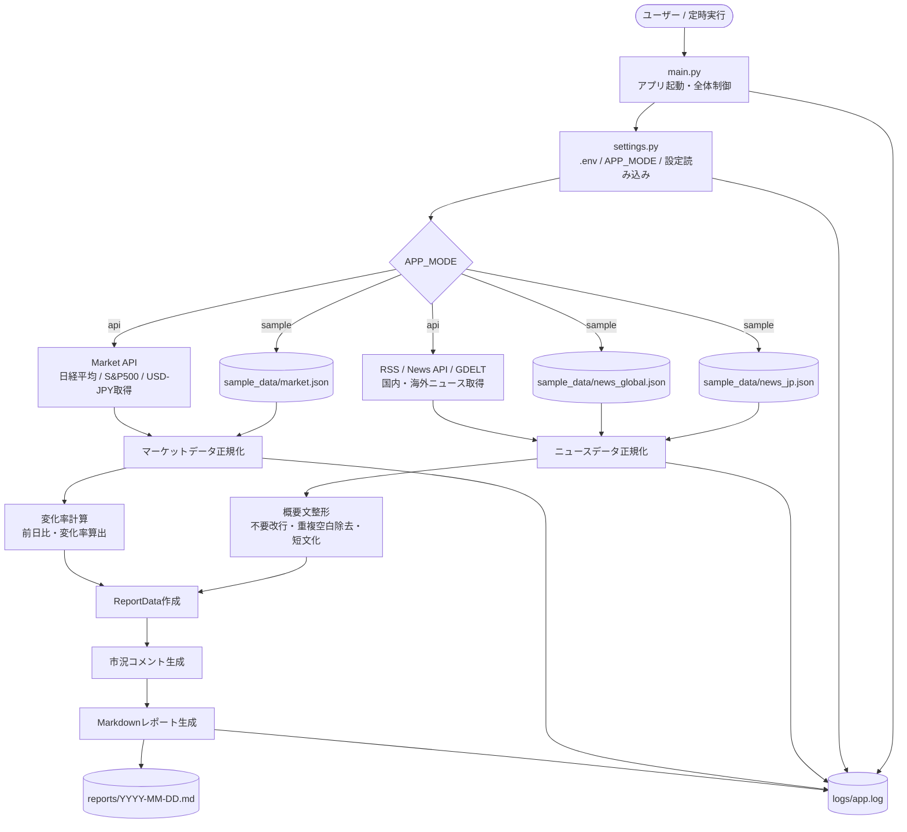
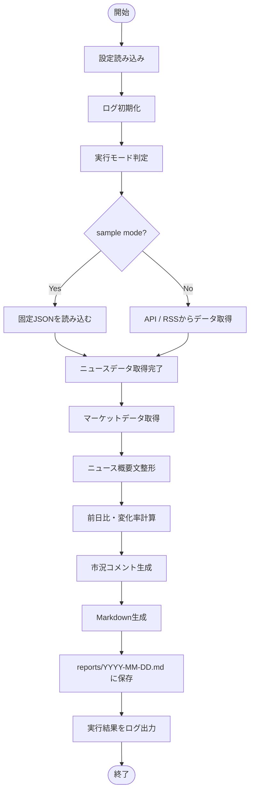

# Morning News 基本設計

## 0. 本書の位置づけ

本書は、`Morning News 要件定義（MVP）` で定義した内容を、実装可能な構成へ落とし込むための基本設計書である。

要件定義では「何を作るのか」を定義し、本書では「どのような構成で実装するか」を定義する。ポートフォリオとして第三者が確認しやすいように、APIキーがなくても `sample` モードで動作確認できる構成を前提とする。

## 1. 設計サマリー

### 1.1 MVPで実現すること

- 国内ニュース、海外ニュース、マーケット情報を取得する。
- 取得したニュース概要文を整形する。
- 日経平均、S&P500、USD/JPYの前日比と変化率を計算する。
- 市況コメントと注意事項を含むMarkdownレポートを生成する。
- `reports/YYYY-MM-DD.md` として日次レポートを保存する。
- APIキーなしでも `sample_data/*.json` からレポートを生成できる。
- 取得失敗や保存失敗をログに残す。

### 1.2 重要な設計方針

| 観点 | 方針 |
| --- | --- |
| 実行方式 | CLIから実行するバッチ処理とする。 |
| 実行モード | `sample` と `api` を分離し、初期値は `sample` とする。 |
| データ形式 | 取得元が異なっても、内部では `NewsItem`、`MarketItem`、`ReportData` に正規化する。 |
| 出力形式 | GitHub、Obsidian、ローカル環境で確認しやすいMarkdownとする。 |
| 障害時の動作 | 一部取得失敗では全体停止せず、取得できた範囲でレポートを生成する。 |
| 機密情報 | APIキーは環境変数から読み込み、ログ・レポート・リポジトリへ出力しない。 |
| ポートフォリオ性 | README、サンプルデータ、サンプルレポート、テストで動作確認できる状態にする。 |

## 2. システム全体構成

### 2.1 全体構成図

Morning News は、ニュース取得、マーケット取得、整形、レポート生成、ログ記録を分離した小さなバッチアプリケーションとして構成する。



### 2.2 モジュール責務

| モジュール | 主な責務 | 対応要件 |
| --- | --- | --- |
| `main.py` | アプリ起動、設定読み込み、処理順序の制御、終了コード制御 | F-01〜F-10 |
| `src/config/` | `.env` と設定ファイルの読み込み、実行モード判定 | F-10 |
| `src/news/` | 国内/海外ニュース取得、ニュース項目の正規化、概要文整形 | F-01, F-02, F-03 |
| `src/market/` | 日経平均、S&P500、USD/JPYの取得、前日比・変化率計算 | F-04, F-05 |
| `src/report/` | Markdown本文生成、注意事項・市況コメント追加、ファイル保存 | F-06, F-07, F-08 |
| `src/utils/` | ログ出力、日時処理、文字列整形、共通例外 | F-03, F-09 |
| `sample_data/` | APIキーなしで動作確認する固定データ | F-10 |

## 3. 実行モード設計

### 3.1 実行モード一覧

| モード | 用途 | データ取得元 | APIキー | 主な利用場面 |
| --- | --- | --- | --- | --- |
| `sample` | ポートフォリオ確認用 | `sample_data/*.json` | 不要 | GitHub閲覧者の動作確認 |
| `api` | 実データ取得用 | RSS / News API / Market API | 必要な場合あり | 実運用・個人利用 |

### 3.2 モード判定ルール

| `APP_MODE` の値 | 動作 |
| --- | --- |
| 未設定 | `sample` モードとして実行する。 |
| `sample` | 固定JSONを読み込んで実行する。 |
| `api` | API/RSSからデータ取得して実行する。 |
| その他の値 | `WARNING` ログを出力し、`sample` モードへフォールバックする。 |

ポートフォリオ用途では、環境変数が未設定でも動作確認できることを優先するため、初期値は `sample` とする。

### 3.3 `sample` モードの動作

`sample` モードでは、API通信を行わず、固定JSONファイルからニュースとマーケット情報を読み込む。

```text
sample_data/
├── news_jp.json
├── news_global.json
└── market.json
```

### 3.4 `api` モードの動作

`api` モードでは、RSS/APIからニュース・市況データを取得する。

- APIキーが必要な場合は `.env` から読み込む。
- APIキーはログやレポートに出力しない。
- RSSなどAPIキー不要の取得元は、APIキー未設定でも取得対象にできる。
- API取得に失敗した場合は、エラーログを出力する。
- 一部データが取得できない場合でも、可能な範囲でレポート生成を継続する。

### 3.5 実行モード異常時の動作

| 発生条件 | 動作 | ログ |
| --- | --- | --- |
| `APP_MODE` 未設定 | `sample` モードで実行する。 | `INFO` |
| `APP_MODE` が不正 | `sample` モードへフォールバックする。 | `WARNING` |
| sample JSONが存在しない | 処理を停止する。 | `ERROR` |
| sample JSONの形式が不正 | 処理を停止する。 | `ERROR` |
| apiモードでAPIキー未設定 | 取得可能なRSSのみ実行、または該当データを欠損扱いにする。 | `WARNING` |
| API通信失敗 | 該当データを欠損扱いにする。 | `ERROR` |
| 一部データ欠損 | 欠損情報をレポートに明記して生成継続する。 | `WARNING` |

## 4. 処理フロー

### 4.1 正常系フロー



### 4.2 処理順序

1. アプリを起動する。
2. `.env` と設定値を読み込む。
3. ログを初期化する。
4. 実行モードを判定する。
5. 国内ニュースを取得する。
6. 海外ニュースを取得する。
7. ニュース概要文を整形する。
8. マーケット情報を取得する。
9. 前日比・変化率を計算する。
10. 市況コメントを生成する。
11. Markdownレポートを生成する。
12. `reports/YYYY-MM-DD.md` に保存する。
13. 成功/失敗件数と保存先をログ出力する。

### 4.3 異常系フロー

| 発生箇所 | 動作 |
| --- | --- |
| 設定読み込み失敗 | デフォルト値で継続できる場合は継続し、できない場合は終了する。 |
| ニュース取得失敗 | 該当カテゴリを「取得できませんでした」として扱い、他カテゴリとマーケット処理は継続する。 |
| マーケット取得失敗 | 取得できた指標のみ出力し、欠損指標は理由をログに残す。 |
| 変化率計算失敗 | 該当指標の前日比・変化率を `N/A` として出力する。 |
| レポート生成失敗 | エラーログを出力し、終了コードを異常終了にする。 |
| レポート保存失敗 | エラーログを出力し、終了コードを異常終了にする。 |

## 5. データ取得・正規化設計

### 5.1 ニュース取得

| 区分 | 取得対象 | 件数目安 | 取得項目 |
| --- | --- | ---: | --- |
| 国内ニュース | 国内カテゴリの記事 | 3〜5件 | タイトル、URL、配信元、公開日時、概要文 |
| 海外ニュース | 海外カテゴリの記事 | 3〜5件 | タイトル、URL、配信元、公開日時、概要文 |

ニュース本文全文、有料記事本文、ログイン後ページ、スクレイピング結果の生データ保存は対象外とする。

### 5.2 マーケット情報取得

| 対象 | 種別 | 取得項目 |
| --- | --- | --- |
| 日経平均 | 株価指数 | 現在値、前日終値、前日比、変化率 |
| S&P500 | 株価指数 | 現在値、前日終値、前日比、変化率 |
| USD/JPY | 為替 | 現在値、前日終値、前日比、変化率 |

### 5.3 取得共通ルール

| 項目 | 設計 |
| --- | --- |
| タイムアウト | 1取得元あたり10秒を仮置き値とする。 |
| リトライ | 1回までを仮置き値とする。 |
| 文字コード | UTF-8を基本とする。 |
| 日時 | 内部処理ではタイムゾーン付き日時として扱い、表示はJSTにそろえる。 |
| 並び順 | 公開日時の新しい順を基本とする。 |
| 重複排除 | URLが同一の記事は重複として除外する。 |

正式なニュース/価格データ取得元は未決のため、本設計では取得元を差し替え可能な構成にする。

### 5.4 ニュースデータの正規化

ニュース取得後、取得元に関係なく `NewsItem` 形式にそろえる。

| 内部項目 | sample JSON | RSS/API取得値 | 備考 |
| --- | --- | --- | --- |
| `category` | `category` | 取得元または設定値 | `domestic` / `global` |
| `title` | `title` | 記事タイトル | 必須 |
| `url` | `url` | 記事URL | 必須 |
| `source` | `source` | フィード名/配信元 | 必須 |
| `published_at` | `published_at` | 公開日時 | JST表示に変換 |
| `summary` | `summary` | description/summary | 任意 |
| `short_summary` | 生成 | 生成 | 120文字以内に整形 |

### 5.5 マーケットデータの正規化

マーケット情報取得後、取得元に関係なく `MarketItem` 形式にそろえる。

| 内部項目 | sample JSON | API取得値 | 備考 |
| --- | --- | --- | --- |
| `symbol` | `symbol` | 指標コード | 必須 |
| `name` | `name` | 表示名 | 必須 |
| `current_value` | `current_value` | 最新値 | 必須 |
| `previous_close` | `previous_close` | 前営業日終値 | 任意 |
| `change` | 計算 | 計算 | `current_value - previous_close` |
| `change_rate` | 計算 | 計算 | `change / previous_close * 100` |
| `unit` | `unit` | 設定値 | 任意 |
| `fetched_at` | `fetched_at` | 取得日時 | 必須 |

### 5.6 `api` モードの無料API候補

本MVPでは、ポートフォリオ用途として無料枠で試せるAPIを候補とする。正式な採用元は、利用規約、無料枠、取得安定性を確認してから決定する。

| データ種別 | 候補 | 用途 | 備考 |
| --- | --- | --- | --- |
| 国内ニュース | NewsAPI / RSS | 国内ニュース取得 | NewsAPI無料枠は開発・テスト用途。 |
| 海外ニュース | GDELT / NewsAPI / GNews | 海外ニュース取得 | GDELTは無料・オープンデータとして利用しやすい。 |
| 株価・指数・為替 | Alpha Vantage / FMP / marketstack | 日経平均、S&P500、USD/JPY等の取得 | 無料枠はリクエスト制限あり。 |

MVPでは、APIキーなしで動作確認できる `sample` モードを標準とし、`api` モードは無料APIの利用制限を考慮して補助的に実装する。

## 6. データ項目定義

### 6.1 `NewsItem`

| 項目 | 型 | 必須 | 説明 |
| --- | --- | --- | --- |
| `category` | string | 必須 | `domestic` または `global`。 |
| `title` | string | 必須 | 記事タイトル。 |
| `url` | string | 必須 | 記事URL。 |
| `source` | string | 必須 | 配信元名。 |
| `published_at` | datetime/string | 必須 | 公開日時。表示時はJSTにそろえる。 |
| `summary` | string | 任意 | 取得元から得られる概要文。 |
| `short_summary` | string | 必須 | 整形後の短い概要。 |

### 6.2 `MarketItem`

| 項目 | 型 | 必須 | 説明 |
| --- | --- | --- | --- |
| `symbol` | string | 必須 | 指標コードまたは識別子。 |
| `name` | string | 必須 | 表示名。 |
| `current_value` | number | 必須 | 現在値。 |
| `previous_close` | number | 任意 | 前営業日終値。 |
| `change` | number | 任意 | 現在値 - 前営業日終値。 |
| `change_rate` | number | 任意 | `change / previous_close * 100`。 |
| `unit` | string | 任意 | 円、ポイント、ドルなど。 |
| `fetched_at` | datetime/string | 必須 | 取得日時。 |

### 6.3 `ReportData`

| 項目 | 型 | 説明 |
| --- | --- | --- |
| `mode` | string | `sample` または `api`。 |
| `generated_at` | datetime/string | レポート作成日時。 |
| `news_domestic` | list[NewsItem] | 国内ニュース一覧。 |
| `news_global` | list[NewsItem] | 海外ニュース一覧。 |
| `markets` | list[MarketItem] | マーケット情報一覧。 |
| `comments` | list[string] | 市況コメント。 |
| `warnings` | list[string] | 継続可能な警告。 |
| `errors` | list[string] | 処理失敗の内容。 |

## 7. `sample_data` JSON仕様

### 7.1 基本方針

`sample_data` は、実在するニュース記事の本文・要約文をコピーせず、ポートフォリオ確認用に作成した架空データとする。これにより、第三者がAPIキーなしで動作確認でき、かつ著作権・利用規約上のリスクを抑えた公開リポジトリ構成とする。

### 7.2 ファイル構成

```text
sample_data/
├── news_jp.json
├── news_global.json
└── market.json
```

### 7.3 `news_jp.json`

`news_jp.json` は、国内ニュースを配列形式で保持する。

```json
{
  "items": [
    {
      "category": "domestic",
      "title": "国内ニュースのサンプルタイトル",
      "url": "https://example.com/jp-news-1",
      "source": "Sample JP News",
      "published_at": "2026-05-16T07:00:00+09:00",
      "summary": "国内経済に関するニュース概要のサンプルです。"
    }
  ]
}
```

| 項目 | 型 | 必須 | 説明 |
| --- | --- | --- | --- |
| `items` | array | 必須 | ニュース記事一覧。 |
| `category` | string | 必須 | `domestic` 固定。 |
| `title` | string | 必須 | 記事タイトル。 |
| `url` | string | 必須 | 記事URL。 |
| `source` | string | 必須 | 配信元。 |
| `published_at` | string | 必須 | 公開日時。ISO 8601形式。 |
| `summary` | string | 任意 | 取得元の概要文。 |

### 7.4 `news_global.json`

`news_global.json` は、海外ニュースを配列形式で保持する。

```json
{
  "items": [
    {
      "category": "global",
      "title": "海外ニュースのサンプルタイトル",
      "url": "https://example.com/global-news-1",
      "source": "Sample Global News",
      "published_at": "2026-05-16T07:00:00+09:00",
      "summary": "海外経済に関するニュース概要のサンプルです。"
    }
  ]
}
```

| 項目 | 型 | 必須 | 説明 |
| --- | --- | --- | --- |
| `items` | array | 必須 | ニュース記事一覧。 |
| `category` | string | 必須 | `global` 固定。 |
| `title` | string | 必須 | 記事タイトル。 |
| `url` | string | 必須 | 記事URL。 |
| `source` | string | 必須 | 配信元。 |
| `published_at` | string | 必須 | 公開日時。ISO 8601形式。 |
| `summary` | string | 任意 | 取得元の概要文。 |

### 7.5 `market.json`

`market.json` は、市況データを配列形式で保持する。

```json
{
  "items": [
    {
      "symbol": "NIKKEI225",
      "name": "日経平均",
      "current_value": 38500.25,
      "previous_close": 38200.00,
      "unit": "points",
      "fetched_at": "2026-05-16T07:00:00+09:00"
    },
    {
      "symbol": "SP500",
      "name": "S&P500",
      "current_value": 5250.10,
      "previous_close": 5200.00,
      "unit": "points",
      "fetched_at": "2026-05-16T07:00:00+09:00"
    },
    {
      "symbol": "USDJPY",
      "name": "USD/JPY",
      "current_value": 155.20,
      "previous_close": 154.80,
      "unit": "yen",
      "fetched_at": "2026-05-16T07:00:00+09:00"
    }
  ]
}
```

| 項目 | 型 | 必須 | 説明 |
| --- | --- | --- | --- |
| `items` | array | 必須 | 市況データ一覧。 |
| `symbol` | string | 必須 | 指標コード。 |
| `name` | string | 必須 | 表示名。 |
| `current_value` | number | 必須 | 現在値。 |
| `previous_close` | number | 任意 | 前営業日終値。 |
| `unit` | string | 任意 | 単位。 |
| `fetched_at` | string | 必須 | 取得日時。 |

## 8. レポート生成設計

### 8.1 出力先

| 項目 | 設計 |
| --- | --- |
| 保存先 | `reports/YYYY-MM-DD.md` |
| サンプルレポート | `reports/sample-report.md` |
| 文字コード | UTF-8 |
| 再実行時 | MVPでは同一日付ファイルを上書きする。履歴保持は未決事項として残す。 |

### 8.2 Markdown構成

```markdown
# Morning News Report
作成日時: YYYY-MM-DD HH:mm JST
実行モード: sample/api

## 1. 今日の注目ポイント

## 2. 国内ニュース

## 3. 海外ニュース

## 4. マーケット情報

## 5. 市況コメント

## 6. 注意事項
本レポートは情報提供を目的としており、投資助言ではありません。
```

### 8.3 表示ルール

| 対象 | 表示ルール |
| --- | --- |
| ニュース | タイトル、配信元、公開日時、概要、URLを表示する。 |
| ニュース件数 | 国内・海外それぞれ最大5件を仮置き値とする。 |
| 概要文 | 改行と重複空白を除去し、120文字以内を仮置き値とする。 |
| マーケット情報 | 対象、現在値、前日比、変化率を表形式で表示する。 |
| 欠損データ | `N/A` または「取得できませんでした」と表示する。 |
| 注意事項 | 投資助言ではない旨を必ず表示する。 |

### 8.4 市況コメント生成ルール

市況コメントは数値変動の説明に限定し、売買判断を促す表現は使わない。

| 条件 | コメント例 |
| --- | --- |
| 変化率が正 | `前日比で上昇傾向です。` |
| 変化率が負 | `前日比で下落傾向です。` |
| 変化率が0または小さい | `前日比で大きな変動は見られません。` |
| 欠損あり | `一部データが取得できないため、市場全体の確認が必要です。` |

禁止表現は要件定義の市況コメント方針に従い、`買うべき`、`売るべき`、`今が買い時`、`必ず上がる`、`投資すべき`、`利益が出る` を使用しない。

## 9. ログ設計

### 9.1 出力先と形式

| 項目 | 設計 |
| --- | --- |
| 出力先 | `logs/app.log` と標準出力 |
| ログ形式 | `日時 レベル 機能ID 処理名 メッセージ` |
| 日時 | JST |
| ログレベル | `INFO`, `WARNING`, `ERROR` |

### 9.2 ログ出力対象

| レベル | 出力内容 |
| --- | --- |
| `INFO` | 起動、モード判定、取得件数、レポート保存先、正常終了。 |
| `WARNING` | 一部取得失敗、任意項目欠損、`sample` モードへのフォールバック。 |
| `ERROR` | 設定不備、全取得失敗、レポート生成失敗、保存失敗。 |

### 9.3 機密情報の扱い

- APIキー、トークン、認証ヘッダー、`.env` の内容はログに出力しない。
- 外部APIのエラーレスポンスを記録する場合も、認証情報を含むURLやヘッダーはマスクする。
- レポート本文にもAPIキーや内部設定値を出力しない。

## 10. エラー処理方針

| エラー | 継続可否 | レポート表示 | ログ |
| --- | --- | --- | --- |
| 国内ニュース取得失敗 | 継続 | 国内ニュース欄に取得失敗メッセージ | `WARNING F-01` |
| 海外ニュース取得失敗 | 継続 | 海外ニュース欄に取得失敗メッセージ | `WARNING F-02` |
| 概要文整形失敗 | 継続 | 元の概要文または空文字 | `WARNING F-03` |
| マーケット一部取得失敗 | 継続 | 該当指標を `N/A` | `WARNING F-04` |
| マーケット全取得失敗 | 継続 | マーケット欄に取得失敗メッセージ | `ERROR F-04` |
| 変化率計算失敗 | 継続 | 前日比・変化率を `N/A` | `WARNING F-05` |
| レポート生成失敗 | 停止 | なし | `ERROR F-06` |
| レポート保存失敗 | 停止 | なし | `ERROR F-08` |
| ログ出力失敗 | 継続 | 影響なし | 標準出力へ出力 |

終了コードは、正常終了を `0`、レポート生成または保存に失敗した場合を `1`、データ取得が全滅した場合を `2` とする。

## 11. ディレクトリ・モジュール構成

### 11.1 ディレクトリ構成

```text
morning-news/
├── README.md
├── requirements.txt
├── .env.example
├── .gitignore
├── main.py
├── src/
│   ├── news/
│   │   ├── fetcher.py
│   │   └── formatter.py
│   ├── market/
│   │   ├── fetcher.py
│   │   └── calculator.py
│   ├── report/
│   │   ├── generator.py
│   │   └── writer.py
│   ├── config/
│   │   └── settings.py
│   └── utils/
│       ├── logger.py
│       └── datetime.py
├── sample_data/
│   ├── news_jp.json
│   ├── news_global.json
│   └── market.json
├── reports/
│   └── sample-report.md
├── logs/
│   └── .gitkeep
└── tests/
```

### 11.2 主要ファイルの役割

| ファイル                       | 役割                            |
| -------------------------- | ----------------------------- |
| `main.py`                  | CLIエントリポイント。全体の処理順序を制御する。     |
| `src/config/settings.py`   | 環境変数、デフォルト値、実行モードを管理する。       |
| `src/news/fetcher.py`      | `sample`/`api` のニュース取得を抽象化する。 |
| `src/news/formatter.py`    | 概要文整形、文字数制限、重複空白除去を行う。        |
| `src/market/fetcher.py`    | 指標価格を取得する。                    |
| `src/market/calculator.py` | 前日比と変化率を計算する。                 |
| `src/report/generator.py`  | Markdown文字列を生成する。             |
| `src/report/writer.py`     | レポートファイルを保存する。                |
| `src/utils/logger.py`      | ログ設定と共通ログ出力を行う。               |

### 11.3 モジュール間データ連携

各モジュールは、取得元や保存先に直接依存しすぎないように、共通データ形式を受け渡す。

```text
main.py
  ↓
settings.py
  ↓
news/fetcher.py       → list[NewsItem]
news/formatter.py     → list[NewsItem]
market/fetcher.py     → list[MarketItem]
market/calculator.py  → list[MarketItem]
report/generator.py   → Markdown文字列
report/writer.py      → 保存先パス
```

### 11.4 モジュール入出力

| モジュール | 入力 | 出力 |
| --- | --- | --- |
| `settings.py` | `.env`, 環境変数 | `Settings` |
| `news/fetcher.py` | `Settings` | `list[NewsItem]` |
| `news/formatter.py` | `list[NewsItem]` | `list[NewsItem]` |
| `market/fetcher.py` | `Settings` | `list[MarketItem]` |
| `market/calculator.py` | `list[MarketItem]` | `list[MarketItem]` |
| `report/generator.py` | `ReportData` | Markdown文字列 |
| `report/writer.py` | Markdown文字列, 保存先 | 保存ファイルパス |
| `logger.py` | ログメッセージ | `logs/app.log` |

## 12. 設定・環境変数設計

### 12.1 `.env.example`

```text
APP_MODE=sample
NEWS_API_KEY=
MARKET_API_KEY=
REPORT_DIR=reports
LOG_DIR=logs
NEWS_LIMIT=5
SUMMARY_MAX_LENGTH=120
REQUEST_TIMEOUT_SECONDS=10
REQUEST_RETRY_COUNT=1
MARKET_REQUEST_INTERVAL_SECONDS=0
```

### 12.2 設定値

| 設定 | デフォルト | 説明 |
| --- | --- | --- |
| `APP_MODE` | `sample` | 実行モード。 |
| `NEWS_API_KEY` | 空 | ニュースAPIを利用する場合のAPIキー。 |
| `MARKET_API_KEY` | 空 | マーケットAPIを利用する場合のAPIキー。 |
| `REPORT_DIR` | `reports` | レポート出力先。 |
| `LOG_DIR` | `logs` | ログ出力先。 |
| `NEWS_LIMIT` | `5` | 国内/海外それぞれの最大出力件数。 |
| `SUMMARY_MAX_LENGTH` | `120` | 概要文の最大文字数。 |
| `REQUEST_TIMEOUT_SECONDS` | `10` | 外部取得のタイムアウト秒数。 |
| `REQUEST_RETRY_COUNT` | `1` | 外部取得のリトライ回数。 |
| `MARKET_REQUEST_INTERVAL_SECONDS` | `0` | マーケットAPIを複数対象へ連続実行するときの待機秒数。 |

## 13. テスト方針

### 13.1 テスト対象

| 要件ID | テスト観点 |
| --- | --- |
| F-01 | 国内ニュースを1件以上取得し、必要項目を保持できる。 |
| F-02 | 海外ニュースを1件以上取得し、必要項目を保持できる。 |
| F-03 | 改行・重複空白を除去し、概要文を最大文字数以内に整形できる。 |
| F-04 | 日経平均、S&P500、USD/JPYのデータを扱える。 |
| F-05 | 前日比と変化率を正しく計算できる。 |
| F-06 | 必須セクションを含むMarkdownを生成できる。 |
| F-07 | 市況コメントに投資助言と誤認される禁止表現が含まれない。 |
| F-08 | `reports/YYYY-MM-DD.md` に保存できる。 |
| F-09 | 失敗時に日時・機能ID・原因をログ出力できる。 |
| F-10 | `APP_MODE=sample` でAPIキーなしにレポート生成できる。 |

### 13.2 テスト種別

| 種別 | 内容 |
| --- | --- |
| 単体テスト | 概要文整形、変化率計算、Markdown生成、市況コメント生成を検証する。 |
| 結合テスト | `sample` モードで起動からレポート保存までを検証する。 |
| 異常系テスト | JSON欠損、取得失敗、保存失敗、APIキー未設定を検証する。 |
| セキュリティ確認 | `.env`、APIキー、認証情報が出力物やリポジトリに含まれないことを確認する。 |

## 14. 実装フェーズ

本MVPは、以下の順番で段階的に実装する。

| Phase   | 内容                             | 完了条件                                     |
| ------- | ------------------------------ | ---------------------------------------- |
| Phase 1 | `sample_data` からMarkdownレポート生成 | APIキーなしで `reports/YYYY-MM-DD.md` が作成される。 |
| Phase 2 | ログ・エラー処理追加                     | 実行結果と失敗理由が `logs/app.log` に出力される。        |
| Phase 3 | 概要文整形・変化率計算追加                  | ニュース概要と市況の変化率が整形される。                     |
| Phase 4 | RSS/API取得追加                    | `APP_MODE=api` で外部データ取得できる。              |
| Phase 5 | pytest追加                       | 主要処理のテストが通る。                             |
| Phase 6 | README・サンプルレポート整備              | 第三者が手順通りに実行できる。                          |

## 15. 要件対応表

| 要件ID | 基本設計での対応箇所 |
| --- | --- |
| F-01 国内ニュース取得 | 5.1, 5.4, 6.1, 10, 13 |
| F-02 海外ニュース取得 | 5.1, 5.4, 6.1, 10, 13 |
| F-03 概要文整形 | 5.4, 6.1, 8.3, 11.2, 13 |
| F-04 マーケット情報取得 | 5.2, 5.5, 6.2, 10, 13 |
| F-05 変化率計算 | 5.5, 6.2, 11.2, 13 |
| F-06 レポート生成 | 8.1〜8.3, 11.2, 13 |
| F-07 市況コメント | 8.4, 13 |
| F-08 レポート保存 | 8.1, 10, 11.2, 13 |
| F-09 エラーログ | 9, 10, 13 |
| F-10 サンプル実行 | 3, 7, 12, 13 |

## 16. ポートフォリオで見せるポイント

- 要件IDと設計項目を対応させ、要件から実装へ落とし込めることを示す。
- `sample` モードにより、APIキーなしでも第三者がローカルで動作確認できることを示す。
- 取得、整形、計算、生成、保存、ログをモジュール分割し、小さなバッチアプリとして構成できることを示す。
- 失敗時も取得できた範囲でレポートを作る方針を明記し、運用を意識した設計であることを示す。
- APIキーを公開しない設計、`.env.example`、`.gitignore`、サンプルデータにより、公開リポジトリとしての安全性を示す。

## 17. 未決事項

| 項目 | 状態 | 今後決めること |
| --- | --- | --- |
| ニュース取得元 | 未決 | RSS、News API、GDELT等から正式採用する取得元を決める。 |
| 価格データ取得元 | 未決 | 日経平均、S&P500、USD/JPYを安定取得できるAPIを決める。 |
| 概要文の文字数 | 仮置き | 本設計では120文字。80文字との比較で最終決定する。 |
| 市況コメント閾値 | 仮置き | 変化率何%以上を上昇/下落として扱うか決める。 |
| バッチ実行時刻 | 未決 | JSTで何時に実行するか決める。 |
| リトライ回数 | 仮置き | 本設計では1回。API制限と実行時間を見て調整する。 |
| レポート再実行時の扱い | 仮置き | 本設計では上書き。履歴保持が必要か決める。 |
