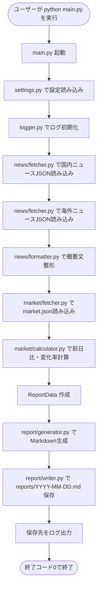
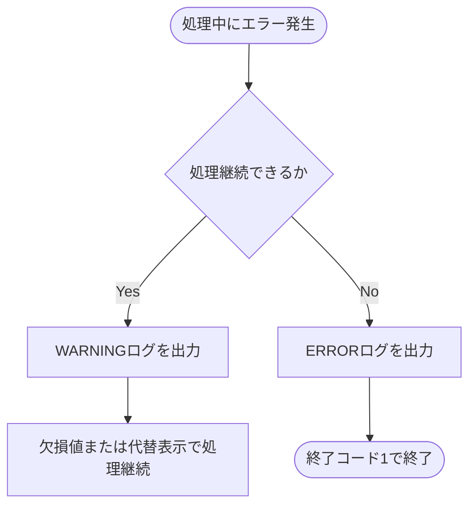

# Morning News 詳細設計 Phase 1

| Phase | 対象 | 完了条件 |
| --- | --- | --- |
| Phase 1 | `sample_data` からMarkdownレポート生成 | APIキーなしで `reports/YYYY-MM-DD.md` が作成される。 |

## 1. 詳細設計の目的

本書は、要件定義および基本設計で定義した内容をもとに、実装に必要なファイル構成、関数名、処理内容、入出力、エラー処理を具体化するための詳細設計書である。

本プロジェクトでは、開発範囲を Phase ごとに分けて進める。
そのため、本書ではまず Phase 1 の対象範囲を明確にし、次フェーズ以降の機能や全体構想が混在しないようにする。

Phase 1 では、`sample_data` のJSONファイルを読み込み、Markdownレポートを生成・保存する最小機能を対象とする。

## 2. Phase 1 の対象範囲

Phase 1 では、API通信を行わず、`sample_data` に配置した固定JSONファイルを読み込み、Markdownレポートを生成・保存する最小機能を実装対象とする。

### 2.1 Phase 1 で実装する機能

| 対象 | 内容 |
| --- | --- |
| サンプルニュース読み込み | `sample_data/news_jp.json` と `sample_data/news_global.json` を読み込む |
| サンプルマーケット読み込み | `sample_data/market.json` を読み込む |
| 概要文整形 | ニュース概要文の改行・重複空白を除去し、指定文字数以内に整形する |
| 変化率計算 | `current_value` と `previous_close` から前日比・変化率を計算する |
| Markdown生成 | ニュース、市況、注意事項を含むMarkdownレポートを生成する |
| レポート保存 | `reports/YYYY-MM-DD.md` にレポートを保存する |
| 基本ログ出力 | 起動、読み込み、生成、保存の結果をログ出力する |

### 2.2 Phase 1 では実装しない機能

| 対象外 | 理由 |
| --- | --- |
| API/RSSからのニュース取得 | Phase 4 で実装する |
| 株価APIからの実データ取得 | Phase 4 で実装する |
| AIによる高度な要約 | MVP対象外 |
| メール・LINE通知 | 後続フェーズで検討する |
| Web UI | MVP対象外 |
| 自動売買・投資助言 | 本システムの対象外 |

### 2.3 Phase 1 で使用する主なファイル

| ファイル | 役割 |
| --- | --- |
| `main.py` | CLIエントリポイント。全体の処理順序を制御する |
| `src/config/settings.py` | 設定値、出力先、最大文字数などを管理する |
| `src/news/fetcher.py` | `sample_data` からニュースデータを読み込む |
| `src/news/formatter.py` | ニュース概要文を整形する |
| `src/market/fetcher.py` | `sample_data` からマーケットデータを読み込む |
| `src/market/calculator.py` | 前日比と変化率を計算する |
| `src/report/generator.py` | Markdownレポート本文を生成する |
| `src/report/writer.py` | レポートファイルを保存する |
| `src/utils/logger.py` | 実行結果とエラーをログ出力する |

## 3. ファイル構成

Phase 1 では、`morning-news/` 配下に以下の構成で実装する。
ユーザーは `main.py` を実行し、`main.py` が設定読み込み、サンプルデータ取得、整形、計算、Markdown生成、保存を順番に呼び出す。

```text
morning-news/
├── README.md
├── requirements.txt
├── main.py
├── src/
│   ├── config/
│   │   └── settings.py
│   ├── news/
│   │   ├── fetcher.py
│   │   └── formatter.py
│   ├── market/
│   │   ├── fetcher.py
│   │   └── calculator.py
│   ├── report/
│   │   ├── generator.py
│   │   └── writer.py
│   └── utils/
│       └── logger.py
├── sample_data/
│   ├── news_jp.json
│   ├── news_global.json
│   └── market.json
├── reports/
│   └── .gitkeep
├── logs/
│   └── .gitkeep
└── tests/
```

### 3.1 モジュール依存関係

Phase 1 の処理は、以下の方向にのみ依存する。
下位モジュールから `main.py` を呼び出さない。

```text
main.py
  ├── src/config/settings.py
  ├── src/utils/logger.py
  ├── src/news/fetcher.py
  ├── src/news/formatter.py
  ├── src/market/fetcher.py
  ├── src/market/calculator.py
  ├── src/report/generator.py
  └── src/report/writer.py
```

### 3.2 各ファイルの責務

| ファイル | 責務 |
| --- | --- |
| `main.py` | ユーザーが実行する入口。全体の処理順序、例外処理、終了コードを制御する。 |
| `src/config/settings.py` | Phase 1 で使うパス、出力先、件数上限、概要文字数上限を定義する。 |
| `src/news/fetcher.py` | `sample_data/news_jp.json` と `sample_data/news_global.json` を読み込み、ニュース配列を返す。 |
| `src/news/formatter.py` | ニュース概要文の改行、タブ、重複空白を除去し、最大文字数以内に丸める。 |
| `src/market/fetcher.py` | `sample_data/market.json` を読み込み、マーケット配列を返す。 |
| `src/market/calculator.py` | `current_value` と `previous_close` から `change` と `change_rate` を計算する。 |
| `src/report/generator.py` | 整形済みニュースと計算済みマーケット情報からMarkdown本文を生成する。 |
| `src/report/writer.py` | `reports/YYYY-MM-DD.md` にMarkdown本文を保存する。 |
| `src/utils/logger.py` | 標準出力とログファイルへ実行状況を出力する。 |

### 3.3 Phase 1 の実行コマンド

```bash
python main.py
```

Phase 1 ではCLI引数を必須にしない。
実行日付をもとに `reports/YYYY-MM-DD.md` を作成する。


## 4. データ構造

Phase 1 ではクラスを必須にせず、Pythonの `dict` と `list` でデータを受け渡す。
ただし、モジュール間で項目名がぶれないように、以下の内部データ構造に統一する。

### 4.1 `NewsItem`

ニュース1件を表す内部データ。

| 項目 | 型 | 必須 | 説明 |
| --- | --- | --- | --- |
| `region` | `str` | 必須 | `domestic` または `global`。 |
| `category` | `str` | 必須 | `economy`, `market`, `tech` など。 |
| `title` | `str` | 必須 | 記事タイトル。 |
| `url` | `str` | 必須 | 記事URL。 |
| `source` | `str` | 必須 | 配信元。 |
| `published_at` | `str` | 必須 | 公開日時。ISO 8601形式を想定する。 |
| `summary` | `str` | 任意 | サンプルJSONに入っている概要文。 |
| `short_summary` | `str` | 必須 | `formatter.py` で整形した概要文。 |

内部表現例:

```python
{
    "region": "domestic",
    "category": "economy",
    "title": "国内ニュースのサンプルタイトル",
    "url": "https://example.com/jp-news-1",
    "source": "Sample JP News",
    "published_at": "2026-05-19T07:00:00+09:00",
    "summary": "国内経済に関するニュース概要のサンプルです。",
    "short_summary": "国内経済に関するニュース概要のサンプルです。"
}
```

### 4.2 `MarketItem`

マーケット情報1件を表す内部データ。

| 項目 | 型 | 必須 | 説明 |
| --- | --- | --- | --- |
| `symbol` | `str` | 必須 | 指標コード。例: `NIKKEI225`, `SP500`, `USDJPY`。 |
| `name` | `str` | 必須 | 表示名。 |
| `current_value` | `int` / `float` | 必須 | 現在値。 |
| `previous_close` | `int` / `float` | 必須 | 前営業日終値。 |
| `change` | `float` | 計算後必須| `current_value - previous_close`。 |
| `change_rate` | `float` | 計算後必須 | `change / previous_close * 100`。 |
| `unit` | `str` | 任意 | 単位。 |
| `fetched_at` | `str` | 必須 | 取得日時。ISO 8601形式を想定する。 |

内部表現例:

```python
{
    "symbol": "NIKKEI225",
    "name": "日経平均",
    "current_value": 38500.25,
    "previous_close": 38200.00,
    "change": 300.25,
    "change_rate": 0.79,
    "unit": "points",
    "fetched_at": "2026-05-19T07:00:00+09:00"
}
```

### 4.3 `ReportData`

Markdown生成に渡すレポート用データ。

| 項目 | 型 | 説明 |
| --- | --- | --- |
| `generated_at` | `str` | レポート生成日時。 |
| `mode` | `str` | Phase 1 では `sample` 固定。 |
| `news_domestic` | `list[NewsItem]` | 国内ニュース一覧。 |
| `news_global` | `list[NewsItem]` | 海外ニュース一覧。 |
| `markets` | `list[MarketItem]` | マーケット情報一覧。 |
| `warnings` | `list[str]` | 欠損など、処理継続できる警告。 |

内部表現例:

```python
{
    "generated_at": "2026-05-19 07:00 JST",
    "mode": "sample",
    "news_domestic": [news_item],
    "news_global": [news_item],
    "markets": [market_item],
    "warnings": []
}
```

### 4.4 `sample_data` JSON仕様

`sample_data/news_jp.json` と `sample_data/news_global.json` は、以下の形式とする。
ニュースの地域区分は `region`、内容分類は `category` に分けて保持する。

`sample_data/news_jp.json` の例:

```json
{
  "items": [
    {
      "region": "domestic",
      "category": "economy",
      "title": "国内ニュースのサンプルタイトル",
      "url": "https://example.com/jp-news-1",
      "source": "Sample JP News",
      "published_at": "2026-05-19T07:00:00+09:00",
      "summary": "国内経済に関するニュース概要のサンプルです。"
    }
  ]
}
```

`sample_data/news_global.json` の例:

```json
{
  "items": [
    {
      "region": "global",
      "category": "market",
      "title": "Global market sample news title",
      "url": "https://example.com/global-news-1",
      "source": "Sample Global News",
      "published_at": "2026-05-19T07:00:00+09:00",
      "summary": "This is a sample summary for global market news."
    }
  ]
}
```

`sample_data/market.json` は、以下の形式とする。

```json
{
  "items": [
    {
      "symbol": "NIKKEI225",
      "name": "日経平均",
      "current_value": 38500.25,
      "previous_close": 38200.00,
      "unit": "points",
      "fetched_at": "2026-05-19T07:00:00+09:00"
    }
  ]
}
```

## 5. 関数設計

### 5.1 `main.py`

| 関数 | 入力 | 出力 | 処理内容 |
| --- | --- | --- | --- |
| `main()` | なし | `int` | 全体処理を実行し、終了コードを返す。 |
| `build_report_data(settings)` | `dict` | `ReportData` | ニュース取得、概要整形、マーケット取得、変化率計算を実行し、レポート用データにまとめる。 |

`main()` の責務:

1. 設定を読み込む。
2. ログを初期化する。
3. `sample_data` からニュースとマーケット情報を読み込む。
4. ニュース概要を整形する。
5. マーケット変化率を計算する。
6. `ReportData` を組み立てる。
7. Markdown本文を生成する。
8. `reports/YYYY-MM-DD.md` に保存する。
9. 成功時は `0`、失敗時は `1` を返す。

### 5.2 `src/config/settings.py`

| 関数 / 定数 | 入力 | 出力 | 処理内容 |
| --- | --- | --- | --- |
| `load_settings()` | なし | `dict` | Phase 1 で使用する設定値を返す。 |
| `BASE_DIR` | なし | `Path` | プロジェクトルート。 |
| `SAMPLE_DATA_DIR` | なし | `Path` | `sample_data/` のパス。 |
| `REPORT_DIR` | なし | `Path` | `reports/` のパス。 |
| `LOG_DIR` | なし | `Path` | `logs/` のパス。 |
| `NEWS_LIMIT` | なし | `int` | 国内/海外ニュースの最大件数。初期値は `5`。 |
| `SUMMARY_MAX_LENGTH` | なし | `int` | 概要文の最大文字数。初期値は `120`。 |

Phase 1 では `.env` 読み込みは必須にしない。
`APP_MODE` は `sample` 固定として扱う。

### 5.3 `src/news/fetcher.py`

| 関数 | 入力 | 出力 | 処理内容 |
| --- | --- | --- | --- |
| `load_news_items(file_path)` | `Path` | `list[dict]` | 指定されたJSONファイルを読み込み、ニュース一覧を返す。 |
| `fetch_sample_news(settings)` | `dict` | `tuple[list[dict], list[dict]]` | 国内ニュースと海外ニュースを読み込んで返す。 |

処理ルール:

- JSONのトップレベルは `items` を必須とする。
- `items` が配列でない場合はエラーにする。
- 必須項目 `region`, `category`, `title`, `url`, `source`, `published_at` がない場合は、その項目をエラーとして扱う。
- `region` は `domestic` または `global` のみ許可する。
- `category` は `economy`, `market`, `tech` などのニュース分類を表す文字列とする。
- `summary` がない場合は空文字として扱う。
- 読み込む件数は `NEWS_LIMIT` までとする。

### 5.4 `src/news/formatter.py`

| 関数 | 入力 | 出力 | 処理内容 |
| --- | --- | --- | --- |
| `format_summary(summary, max_length)` | `str`, `int` | `str` | 改行、タブ、重複空白を除去し、最大文字数以内に整形する。 |
| `format_news_items(items, max_length)` | `list[dict]`, `int` | `list[dict]` | 各ニュースに `short_summary` を追加して返す。 |

整形ルール:

- `\n`, `\r`, `\t` は半角スペースに置換する。
- 連続する空白は1つにまとめる。
- 前後の空白は削除する。
- `max_length` を超える場合は末尾を `...` にする。
- `summary` が空の場合、`short_summary` は `概要はありません。` とする。

### 5.5 `src/market/fetcher.py`

| 関数 | 入力 | 出力 | 処理内容 |
| --- | --- | --- | --- |
| `load_market_items(file_path)` | `Path` | `list[dict]` | `sample_data/market.json` を読み込み、マーケット一覧を返す。 |
| `fetch_sample_markets(settings)` | `dict` | `list[dict]` | Phase 1 用のマーケットデータを返す。 |

処理ルール:

- JSONのトップレベルは `items` を必須とする。
- `items` が配列でない場合はエラーにする。
- 必須項目 `symbol`, `name`, `current_value`, `previous_close`, `fetched_at` がない場合はエラーにする。
- `current_value` と `previous_close` は数値のみ許可する。

### 5.6 `src/market/calculator.py`

| 関数 | 入力 | 出力 | 処理内容 |
| --- | --- | --- | --- |
| `calculate_change(current_value, previous_close)` | `float`, `float` | `tuple[float, float]` | 前日比と変化率を計算する。 |
| `calculate_market_changes(items)` | `list[dict]` | `list[dict]` | 各マーケット項目に `change` と `change_rate` を追加する。 |

計算ルール:

- `change = current_value - previous_close`
- `change_rate = change / previous_close * 100`
- `change` は小数第2位まで丸める。
- `change_rate` は小数第2位まで丸める。
- `previous_close` が `0` の場合は計算不可とし、`change` と `change_rate` を `None` にする。

### 5.7 `src/report/generator.py`

| 関数 | 入力 | 出力 | 処理内容 |
| --- | --- | --- | --- |
| `generate_report(report_data)` | `dict` | `str` | Markdownレポート全文を生成する。 |
| `generate_news_section(title, items)` | `str`, `list[dict]` | `str` | 国内/海外ニュースセクションを生成する。 |
| `generate_market_section(items)` | `list[dict]` | `str` | マーケット情報のMarkdown表を生成する。 |
| `generate_market_comments(items)` | `list[dict]` | `list[str]` | 市況コメントを生成する。 |

Markdown構成:

```markdown
# Morning News Report
作成日時: YYYY-MM-DD HH:mm JST
実行モード: sample

## 1. 今日の注目ポイント

## 2. 国内ニュース

## 3. 海外ニュース

## 4. マーケット情報

## 5. 市況コメント

## 6. 注意事項
本レポートは情報提供を目的としており、投資助言ではありません。
```

市況コメントルール:

| 条件 | コメント |
| --- | --- |
| `change_rate > 0` | `{name} は前日比で上昇傾向です。` |
| `change_rate < 0` | `{name} は前日比で下落傾向です。` |
| `change_rate == 0` | `{name} は前日比で大きな変動は見られません。` |
| `change_rate is None` | `{name} は変化率を計算できませんでした。` |

### 5.8 `src/report/writer.py`

| 関数 | 入力 | 出力 | 処理内容 |
| --- | --- | --- | --- |
| `build_report_path(report_dir, target_date)` | `Path`, `date` | `Path` | `reports/YYYY-MM-DD.md` の保存先を生成する。 |
| `write_report(markdown, report_path)` | `str`, `Path` | `Path` | Markdown本文をUTF-8で保存する。 |

保存ルール:

- `reports/` が存在しない場合は作成する。
- 同一日付のファイルが存在する場合、Phase 1 では上書きする。
- 保存文字コードはUTF-8とする。

### 5.9 `src/utils/logger.py`

| 関数 | 入力 | 出力 | 処理内容 |
| --- | --- | --- | --- |
| `setup_logger(log_dir)` | `Path` | `logging.Logger` | 標準出力と `logs/app.log` へ出力するロガーを作成する。 |
| `get_logger()` | なし | `logging.Logger` | 設定済みロガーを返す。 |

ログ形式:

```text
YYYY-MM-DD HH:mm:ss INFO 処理名 メッセージ
```

Phase 1 で出力する主なログ:

| レベル | 内容 |
| --- | --- |
| `INFO` | 起動、設定読み込み、サンプルデータ読み込み件数、Markdown生成、保存先、正常終了。 |
| `WARNING` | 概要文なし、変化率計算不可など、処理継続できる問題。 |
| `ERROR` | JSON読み込み失敗、必須項目欠損、レポート保存失敗。 |

## 6. 処理順序

### 6.1 正常系



### 6.2 詳細手順

1. ユーザーが `python main.py` を実行する。
2. `main.py` が `load_settings()` を呼び出す。
3. `main.py` が `setup_logger()` を呼び出す。
4. `fetch_sample_news(settings)` で国内・海外ニュースを読み込む。
5. `format_news_items()` で `short_summary` を追加する。
6. `fetch_sample_markets(settings)` でマーケット情報を読み込む。
7. `calculate_market_changes()` で `change` と `change_rate` を追加する。
8. `main.py` が `ReportData` を作成する。
9. `generate_report(report_data)` でMarkdown本文を生成する。
10. `build_report_path()` で保存先パスを作る。
11. `write_report()` で `reports/YYYY-MM-DD.md` に保存する。
12. `main.py` が保存先と正常終了をログ出力する。
13. `main.py` が終了コード `0` を返す。

### 6.3 異常系



## 7. エラー処理

### 7.1 エラー処理一覧

| 発生箇所 | 条件 | 動作 | ログ | 終了コード |
| --- | --- | --- | --- | --- |
| 設定読み込み | パス生成に失敗 | 処理停止 | `ERROR` | `1` |
| ニュースJSON読み込み | ファイルが存在しない | 処理停止 | `ERROR` | `1` |
| ニュースJSON読み込み | JSON形式が不正 | 処理停止 | `ERROR` | `1` |
| ニュースJSON検証 | `items` が存在しない | 処理停止 | `ERROR` | `1` |
| ニュースJSON検証 | 必須項目が欠損 | 処理停止 | `ERROR` | `1` |
| 概要文整形 | `summary` が空 | `概要はありません。` を設定して継続 | `WARNING` | `0` |
| マーケットJSON読み込み | ファイルが存在しない | 処理停止 | `ERROR` | `1` |
| マーケットJSON読み込み | JSON形式が不正 | 処理停止 | `ERROR` | `1` |
| マーケットJSON検証 | 必須項目が欠損 | 処理停止 | `ERROR` | `1` |
| 変化率計算 | `previous_close` が `0` | `change`, `change_rate` を `None` にして継続 | `WARNING` | `0` |
| Markdown生成 | 必須セクション生成に失敗 | 処理停止 | `ERROR` | `1` |
| レポート保存 | `reports/` に書き込めない | 処理停止 | `ERROR` | `1` |
| ログ出力 | `logs/app.log` に書き込めない | 標準出力のみで継続 | `WARNING` | `0` |

### 7.2 Phase 1 の終了コード

| 終了コード | 意味 |
| ---: | --- |
| `0` | 正常終了。レポート保存まで完了した。 |
| `1` | 異常終了。レポートを生成または保存できなかった。 |

### 7.3 エラーメッセージ方針

- どのファイルで失敗したかをログに出す。
- 必須項目欠損時は、欠損した項目名をログに出す。
- APIキー、個人情報、外部サービスの認証情報はログに出さない。
- Phase 1 はサンプルデータのみ扱うため、外部API通信エラーは対象外とする。

## 8. テスト観点

Phase 1 では、API通信を使わず、`sample_data` から `reports/YYYY-MM-DD.md` が作成されることを中心に確認する。

### 8.1 単体テスト

| 対象 | テスト内容 | 期待結果 |
| --- | --- | --- |
| `format_summary()` | 改行、タブ、重複空白を含む文字列を渡す | 空白が整理される |
| `format_summary()` | 最大文字数を超える概要を渡す | 最大文字数以内に丸められる |
| `format_summary()` | 空文字を渡す | `概要はありません。` を返す |
| `calculate_change()` | `current_value=110`, `previous_close=100` を渡す | `change=10`, `change_rate=10.0` |
| `calculate_change()` | `previous_close=0` を渡す | `change=None`, `change_rate=None` |
| `generate_market_section()` | 計算済みマーケット情報を渡す | Markdown表が生成される |
| `build_report_path()` | 日付を渡す | `reports/YYYY-MM-DD.md` が返る |

### 8.2 結合テスト

| テスト内容 | 期待結果 |
| --- | --- |
| `python main.py` を実行する | 終了コード `0` で終了する |
| サンプルJSONを読み込む | 国内ニュース、海外ニュース、マーケット情報が取得される |
| レポートを生成する | Markdownに6つの主要セクションが含まれる |
| レポートを保存する | `reports/YYYY-MM-DD.md` が作成される |
| 再実行する | 同一日付ファイルが上書きされ、異常終了しない |

### 8.3 異常系テスト

| 条件 | 期待結果 |
| --- | --- |
| `sample_data/news_jp.json` が存在しない | 終了コード `1`、`ERROR` ログ |
| JSONの形式が壊れている | 終了コード `1`、`ERROR` ログ |
| `items` が存在しない | 終了コード `1`、`ERROR` ログ |
| ニュース必須項目が欠損している | 終了コード `1`、欠損項目名をログ出力 |
| `summary` が空 | 処理継続し、`概要はありません。` を出力 |
| `previous_close` が `0` | 処理継続し、変化率は `N/A` 表示 |
| `reports/` に保存できない | 終了コード `1`、`ERROR` ログ |

### 8.4 受け入れ条件

- APIキーなしで実行できる。
- `python main.py` のみでレポートが生成される。
- `reports/YYYY-MM-DD.md` が作成される。
- レポートに国内ニュース、海外ニュース、マーケット情報、市況コメント、注意事項が含まれる。
- 注意事項に `本レポートは情報提供を目的としており、投資助言ではありません。` が含まれる。
- 失敗時は原因がログに残る。

## 9. 次フェーズで追加するもの

Phase 1 では、サンプルデータからMarkdownを生成する最小機能に集中する。
以下は次フェーズ以降で追加する。

| フェーズ | 追加内容 |
| --- | --- |
| Phase 2 | ログ出力の詳細化、例外クラス整理、失敗件数の集計。 |
| Phase 3 | 概要文整形と変化率計算のテスト強化、境界値テスト追加。 |
| Phase 4 | RSS/APIからのニュース取得、マーケットAPI取得、`.env` 読み込み。 |
| Phase 5 | pytestによる単体テスト・結合テストの整備。 |
| Phase 6 | README、`.env.example`、サンプルレポート、GitHub公開用チェックの整備。 |

Phase 1 完了時点では、外部API通信、APIキー管理、定時実行、通知、Web UI は実装しない。
