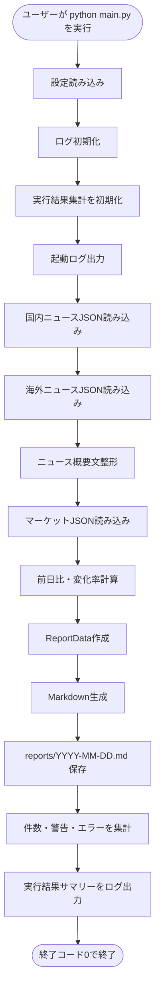
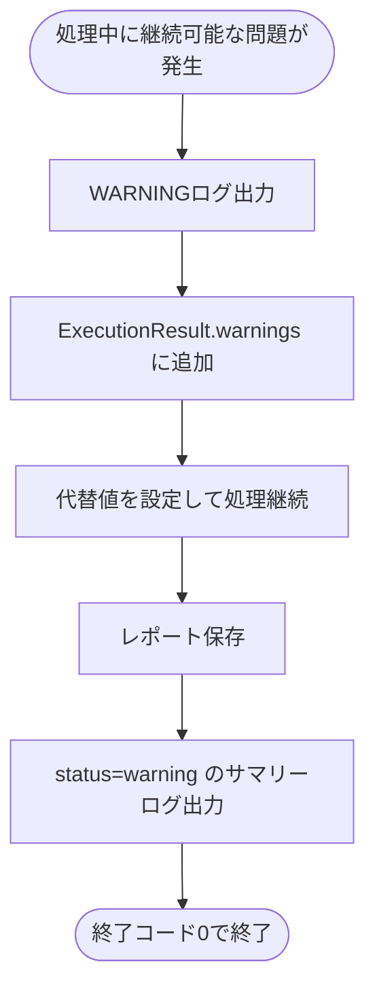
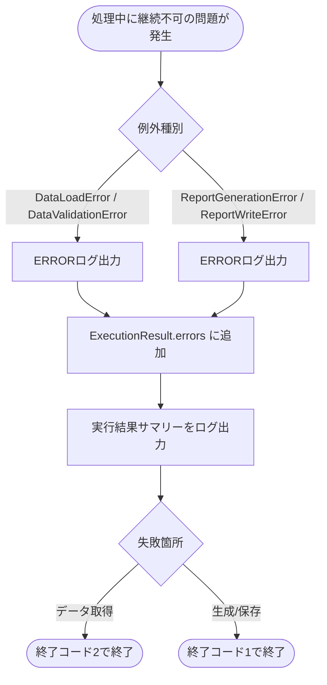

# Morning News 詳細設計 Phase 2

| Phase | 対象 | 完了条件 |
| --- | --- | --- |
| Phase 2 | ログ・エラー処理追加 | 実行結果と失敗理由が `logs/app.log` に出力される。 |

## 1. 詳細設計の目的

本書は、要件定義および基本設計で定義した `F-09 エラーログ` を中心に、Phase 2 で実装するログ出力、例外処理、失敗理由の集計、終了コード制御を具体化するための詳細設計書である。

Phase 1 では、`sample_data` からMarkdownレポートを生成し、`reports/YYYY-MM-DD.md` に保存する最小機能を実装した。
Phase 2 では、Phase 1 の処理結果を追跡しやすくするため、各処理の開始・成功・警告・失敗を機能ID付きでログに残す。

また、例外の種類を整理し、どの失敗を継続可能な警告として扱い、どの失敗を異常終了として扱うかを明確にする。

## 2. Phase 2 の対象範囲

### 2.1 Phase 2 で実装する機能

| 対象 | 内容 |
| --- | --- |
| ログ形式の詳細化 | 日時、ログレベル、機能ID、処理名、メッセージを `logs/app.log` に出力する |
| 処理開始・終了ログ | アプリ起動、設定読み込み、データ読み込み、整形、計算、生成、保存、終了を記録する |
| 件数ログ | 国内ニュース、海外ニュース、マーケット情報、警告、エラーの件数を記録する |
| 失敗理由ログ | 例外発生時に、処理名、機能ID、原因メッセージを記録する |
| 例外クラス整理 | 共通例外クラスと用途別例外クラスを追加する |
| 警告・エラー集計 | `ReportData` に渡す `warnings` と、ログ用の `errors` を集計する |
| 終了コード制御 | 正常終了、レポート生成/保存失敗、データ取得失敗を区別する |
| ログ出力失敗時のフォールバック | `logs/app.log` に書き込めない場合は標準出力のみで継続する |

### 2.2 Phase 2 では実装しない機能

| 対象外 | 理由 |
| --- | --- |
| RSS/APIからの外部データ取得 | Phase 4 で実装する |
| `.env` とAPIキー読み込み | Phase 4 で実装する |
| pytestの網羅的な自動テスト | Phase 5 で整備する |
| ログローテーション | MVPでは必須にしない |
| JSON形式ログ | GitHubやObsidianで読みやすいテキストログを優先する |
| 通知連携 | MVP対象外 |

### 2.3 基本設計との対応

| 基本設計の項目 | Phase 2 での具体化 |
| --- | --- |
| 9. ログ設計 | ログ形式、出力タイミング、機能ID、処理名を詳細化する |
| 10. エラー処理方針 | 継続可否、例外クラス、終了コードを詳細化する |
| 13. テスト方針 | Phase 2 の確認観点としてログ内容と終了コードを定義する |
| 14. 実装フェーズ | Phase 2 の完了条件を、`logs/app.log` の内容で判定できるようにする |

## 3. ファイル構成

Phase 2 では、Phase 1 のファイル構成を維持しつつ、ログ・例外・実行結果集計のために `src/utils/` 配下へファイルを追加する。

```text
morning-news/
├── main.py
├── src/
│   ├── config/
│   │   └── settings.py
│   ├── news/
│   │   ├── fetcher.py
│   │   └── formatter.py
│   ├── market/
│   │   ├── fetcher.py
│   │   └── calculator.py
│   ├── report/
│   │   ├── generator.py
│   │   └── writer.py
│   └── utils/
│       ├── exceptions.py
│       ├── execution_result.py
│       └── logger.py
├── sample_data/
├── reports/
└── logs/
    └── app.log
```

### 3.1 追加・変更対象ファイル

| ファイル | 区分 | 役割 |
| --- | --- | --- |
| `main.py` | 変更 | 各処理のログ出力、例外捕捉、終了コード制御、実行結果集計を行う |
| `src/utils/logger.py` | 変更 | 機能IDと処理名を含むログ形式へ変更する |
| `src/utils/exceptions.py` | 追加 | 共通例外クラスと用途別例外クラスを定義する |
| `src/utils/execution_result.py` | 追加 | 成功件数、警告、エラー、終了ステータスを集計する |
| `src/news/fetcher.py` | 変更 | JSON読み込み・検証失敗を専用例外で通知する |
| `src/news/formatter.py` | 変更 | 概要文なし、文字数設定不正をログ対象として扱う |
| `src/market/fetcher.py` | 変更 | マーケットJSON読み込み・検証失敗を専用例外で通知する |
| `src/market/calculator.py` | 変更 | 計算不可の理由を警告として扱えるようにする |
| `src/report/generator.py` | 変更 | レポート生成失敗を専用例外で通知する |
| `src/report/writer.py` | 変更 | 保存失敗を専用例外で通知する |

### 3.2 モジュール依存関係

`src/utils/` は共通基盤として、各機能モジュールから参照される。
ただし、機能モジュールは `main.py` を呼び出さない。

```text
main.py
  ├── src/config/settings.py
  ├── src/utils/logger.py
  ├── src/utils/exceptions.py
  ├── src/utils/execution_result.py
  ├── src/news/fetcher.py
  ├── src/news/formatter.py
  ├── src/market/fetcher.py
  ├── src/market/calculator.py
  ├── src/report/generator.py
  └── src/report/writer.py
```

## 4. ログ設計

### 4.1 ログ出力先

| 出力先 | 内容 |
| --- | --- |
| 標準出力 | 実行中に確認するためのログ |
| `logs/app.log` | 実行履歴として残すログ |

`logs/` が存在しない場合は作成する。
`logs/app.log` へ書き込めない場合は、警告を標準出力へ出し、標準出力のみで処理を継続する。

### 4.2 ログ形式

Phase 2 のログ形式は以下とする。

```text
YYYY-MM-DD HH:mm:ss LEVEL FEATURE_ID PROCESS_NAME MESSAGE
```

例:

```text
2026-05-21 07:00:00 INFO F-10 settings.load_settings APP_MODE=sample で起動します
2026-05-21 07:00:01 INFO F-01 news.fetcher 国内ニュース読み込み件数: 5
2026-05-21 07:00:01 WARNING F-05 market.calculator USD/JPY は previous_close が 0 のため変化率を計算できませんでした
2026-05-21 07:00:02 ERROR F-08 report.writer レポート保存に失敗しました: reports/2026-05-21.md
```

### 4.3 ログ項目

| 項目 | 内容 | 例 |
| --- | --- | --- |
| 日時 | JSTのログ出力日時 | `2026-05-21 07:00:00` |
| レベル | `INFO`, `WARNING`, `ERROR` | `INFO` |
| 機能ID | 要件IDに対応するID | `F-09` |
| 処理名 | `module.function` 形式 | `news.fetcher` |
| メッセージ | 処理内容、件数、失敗理由 | `国内ニュース読み込み件数: 5` |

### 4.4 ログレベル

| レベル | 出力条件 | 処理継続 |
| --- | --- | --- |
| `INFO` | 起動、設定読み込み、読み込み件数、生成完了、保存先、正常終了 | 継続 |
| `WARNING` | 概要文なし、変化率計算不可、ログファイル書き込み不可など、代替処理で継続できる問題 | 継続 |
| `ERROR` | JSON読み込み失敗、必須項目欠損、Markdown生成失敗、レポート保存失敗など | 停止または終了コード変更 |

### 4.5 機能ID対応

| 機能ID | 対象 | 主なログ |
| --- | --- | --- |
| `F-01` | 国内ニュース取得 | 国内ニュース読み込み開始、件数、失敗理由 |
| `F-02` | 海外ニュース取得 | 海外ニュース読み込み開始、件数、失敗理由 |
| `F-03` | 概要文整形 | 概要文整形開始、整形件数、概要文なし |
| `F-04` | マーケット情報取得 | マーケット読み込み開始、件数、失敗理由 |
| `F-05` | 変化率計算 | 計算開始、計算件数、計算不可理由 |
| `F-06` | レポート生成 | Markdown生成開始、生成完了、生成失敗 |
| `F-07` | 市況コメント | 市況コメント生成件数、禁止表現チェック結果 |
| `F-08` | レポート保存 | 保存開始、保存先、保存失敗 |
| `F-09` | エラーログ | 警告件数、エラー件数、失敗理由の記録 |
| `F-10` | サンプル実行 | 実行モード、APIキー不要実行、モード情報 |

### 4.6 ログ出力タイミング

| 処理 | レベル | 機能ID | メッセージ例 |
| --- | --- | --- | --- |
| アプリ起動 | `INFO` | `F-10` | `Morning News を開始しました` |
| 設定読み込み完了 | `INFO` | `F-10` | `設定読み込み完了: APP_MODE=sample` |
| 国内ニュース読み込み開始 | `INFO` | `F-01` | `国内ニュースJSONを読み込みます` |
| 国内ニュース読み込み成功 | `INFO` | `F-01` | `国内ニュース読み込み件数: 5` |
| 海外ニュース読み込み成功 | `INFO` | `F-02` | `海外ニュース読み込み件数: 5` |
| 概要文なし | `WARNING` | `F-03` | `items[2] の summary が空のため代替文を設定しました` |
| マーケット読み込み成功 | `INFO` | `F-04` | `マーケット読み込み件数: 3` |
| 変化率計算不可 | `WARNING` | `F-05` | `previous_close が 0 のため変化率を計算できませんでした` |
| Markdown生成完了 | `INFO` | `F-06` | `Markdown生成完了` |
| 市況コメント生成完了 | `INFO` | `F-07` | `市況コメント生成件数: 3` |
| レポート保存完了 | `INFO` | `F-08` | `レポート保存先: reports/YYYY-MM-DD.md` |
| 実行結果サマリー | `INFO` / `WARNING` / `ERROR` | `F-09` | `実行結果: status=success warnings=0 errors=0` |
| 正常終了 | `INFO` | `F-10` | `Morning News は正常終了しました` |
| 異常終了 | `ERROR` | `F-09` | `Morning News は失敗しました: <理由>` |

### 4.7 機密情報の扱い

Phase 2 では `sample` モードのみを対象にするが、Phase 4 以降のAPIキー対応を見据え、以下の方針を先に適用する。

- APIキー、トークン、認証ヘッダー、`.env` の内容はログに出さない。
- 例外メッセージにURLを含める場合、クエリパラメータはログに出さない。
- ログには入力ファイルのパス、件数、欠損項目名、処理名を出す。
- ログにはサンプルJSONの本文全体を出さない。

## 5. 例外設計

### 5.1 基本方針

Phase 1 では `FileNotFoundError`, `OSError`, `ValueError` を `main.py` でまとめて捕捉していた。
Phase 2 では、失敗箇所と要件IDをログに残しやすくするため、アプリケーション専用例外を定義する。

例外は `src/utils/exceptions.py` に集約する。

### 5.2 共通例外クラス

```python
class MorningNewsError(Exception):
    """Morning News の共通例外。"""

    def __init__(
        self,
        message: str,
        *,
        feature_id: str,
        process_name: str,
        recoverable: bool = False,
    ) -> None:
        super().__init__(message)
        self.message = message
        self.feature_id = feature_id
        self.process_name = process_name
        self.recoverable = recoverable
```

| 属性 | 型 | 説明 |
| --- | --- | --- |
| `message` | `str` | ログに出す失敗理由 |
| `feature_id` | `str` | 要件ID。例: `F-01` |
| `process_name` | `str` | 処理名。例: `news.fetcher` |
| `recoverable` | `bool` | 継続可能な失敗かどうか |

### 5.3 用途別例外クラス

| 例外クラス | 主な発生箇所 | 機能ID | 継続可否 |
| --- | --- | --- | --- |
| `ConfigError` | `settings.py` | `F-10` | 停止 |
| `DataLoadError` | `news/fetcher.py`, `market/fetcher.py` | `F-01`, `F-02`, `F-04` | 停止 |
| `DataValidationError` | `news/fetcher.py`, `market/fetcher.py` | `F-01`, `F-02`, `F-04` | 停止 |
| `SummaryFormatError` | `news/formatter.py` | `F-03` | 原則継続 |
| `MarketCalculationError` | `market/calculator.py` | `F-05` | 原則継続 |
| `ReportGenerationError` | `report/generator.py` | `F-06`, `F-07` | 停止 |
| `ReportWriteError` | `report/writer.py` | `F-08` | 停止 |
| `LoggingSetupError` | `logger.py` | `F-09` | 標準出力のみで継続 |

### 5.4 例外変換ルール

標準例外は、各モジュール内でアプリケーション専用例外へ変換する。

| 標準例外 | 変換後 | ログ例 |
| --- | --- | --- |
| `FileNotFoundError` | `DataLoadError` | `sample_data/news_jp.json が見つかりません` |
| `json.JSONDecodeError` | `DataLoadError` | `JSON形式が不正です` |
| `ValueError` | `DataValidationError` または `MarketCalculationError` | `必須項目が欠損しています` |
| `OSError` | `ReportWriteError` | `レポート保存に失敗しました` |
| `KeyError` | `ReportGenerationError` | `レポート生成に必要な項目がありません` |

## 6. 実行結果集計設計

### 6.1 目的

ログには個別の処理結果だけでなく、最後に実行全体のサマリーを残す。
これにより、`logs/app.log` を見れば成功件数、警告件数、エラー件数、終了ステータスを確認できる。

### 6.2 `ExecutionResult`

Phase 2 では、Phase 1 の `dict` ベースの設計に合わせ、実行結果も `dict` で扱う。
`src/utils/execution_result.py` に生成・更新用関数を配置する。

内部表現例:

```python
{
    "status": "running",
    "mode": "sample",
    "started_at": "2026-05-21 07:00:00 JST",
    "ended_at": None,
    "counts": {
        "news_domestic": 5,
        "news_global": 5,
        "markets": 3,
        "market_comments": 3,
        "warnings": 0,
        "errors": 0
    },
    "warnings": [],
    "errors": []
}
```

### 6.3 集計関数

| 関数 | 入力 | 出力 | 処理内容 |
| --- | --- | --- | --- |
| `create_execution_result(mode, started_at)` | `str`, `str` | `dict` | 実行結果集計用の初期値を返す |
| `set_count(result, key, count)` | `dict`, `str`, `int` | `None` | 件数を更新する |
| `record_warning(result, feature_id, process_name, message)` | `dict`, `str`, `str`, `str` | `None` | 警告を追加し、警告件数を更新する |
| `record_error(result, feature_id, process_name, message)` | `dict`, `str`, `str`, `str` | `None` | エラーを追加し、エラー件数を更新する |
| `finish_execution(result, status, ended_at)` | `dict`, `str`, `str` | `dict` | 終了ステータスと終了時刻を設定する |
| `build_summary_message(result)` | `dict` | `str` | ログ出力用のサマリーメッセージを作る |

### 6.4 ステータス

| ステータス | 意味 |
| --- | --- |
| `running` | 実行中 |
| `success` | エラーなしで正常終了 |
| `warning` | 警告はあるがレポート保存まで完了 |
| `failed` | レポート生成または保存に失敗 |
| `data_failed` | 必須データの読み込みに失敗 |

## 7. 関数設計

### 7.1 `main.py`

| 関数 | 入力 | 出力 | 処理内容 |
| --- | --- | --- | --- |
| `main()` | なし | `int` | 全体処理を実行し、終了コードを返す |
| `build_report_data(settings, logger, result)` | `dict`, `Logger`, `dict` | `ReportData` | データ取得、整形、計算、警告集計を行う |
| `log_exception(logger, result, error)` | `Logger`, `dict`, `MorningNewsError` | `None` | 例外情報をログと実行結果に記録する |
| `log_execution_summary(logger, result)` | `Logger`, `dict` | `None` | 実行結果サマリーをログ出力する |

`main()` の処理:

1. `load_settings()` を呼び出す。
2. `setup_logger()` を呼び出す。
3. `create_execution_result()` を呼び出す。
4. 起動ログを出力する。
5. `build_report_data()` でレポート用データを作成する。
6. `generate_report()` でMarkdown本文を生成する。
7. `write_report()` でレポートを保存する。
8. 警告・エラー件数を集計する。
9. 実行結果サマリーをログ出力する。
10. 終了コードを返す。

### 7.2 `src/utils/logger.py`

| 関数 / クラス | 入力 | 出力 | 処理内容 |
| --- | --- | --- | --- |
| `JSTFormatter` | `logging.Formatter` | - | ログ日時をJSTで表示する |
| `ContextFormatter` | `logging.Formatter` | - | `feature_id`, `process_name` がないログにも既定値を補完する |
| `setup_logger(log_dir)` | `Path` | `logging.Logger` | 標準出力と `logs/app.log` へ出力するロガーを作成する |
| `get_logger()` | なし | `logging.Logger` | 設定済みロガーを返す |
| `log_info(logger, feature_id, process_name, message, *args)` | 各値 | `None` | `INFO` ログを機能ID付きで出す |
| `log_warning(logger, feature_id, process_name, message, *args)` | 各値 | `None` | `WARNING` ログを機能ID付きで出す |
| `log_error(logger, feature_id, process_name, message, *args)` | 各値 | `None` | `ERROR` ログを機能ID付きで出す |

ログフォーマット:

```python
"%(asctime)s %(levelname)s %(feature_id)s %(process_name)s %(message)s"
```

### 7.3 `src/utils/exceptions.py`

| クラス | 役割 |
| --- | --- |
| `MorningNewsError` | 共通例外 |
| `ConfigError` | 設定読み込み・設定値不正 |
| `DataLoadError` | ファイル読み込み失敗、JSON解析失敗 |
| `DataValidationError` | JSON必須項目欠損、型不正 |
| `SummaryFormatError` | 概要文整形失敗 |
| `MarketCalculationError` | 前日比・変化率計算失敗 |
| `ReportGenerationError` | Markdown生成失敗 |
| `ReportWriteError` | レポート保存失敗 |
| `LoggingSetupError` | ログファイル設定失敗 |

### 7.4 `src/utils/execution_result.py`

| 関数 | 処理内容 |
| --- | --- |
| `create_execution_result()` | 実行結果の初期値を返す |
| `set_count()` | 件数を設定する |
| `increment_count()` | 件数を加算する |
| `record_warning()` | 警告情報を追加する |
| `record_error()` | エラー情報を追加する |
| `finish_execution()` | 終了ステータスと終了時刻を設定する |
| `build_summary_message()` | サマリーログ用の文字列を作る |

### 7.5 `src/news/fetcher.py`

| 関数 | Phase 2 の変更点 |
| --- | --- |
| `_load_json(file_path)` | `FileNotFoundError` と `json.JSONDecodeError` を `DataLoadError` に変換する |
| `_validate_news_item(item, index, file_path)` | 必須項目欠損や `region` 不正を `DataValidationError` に変換する |
| `load_news_items(file_path, feature_id)` | 機能IDを受け取り、国内/海外どちらの失敗か識別できるようにする |
| `fetch_sample_news(settings)` | 国内と海外の読み込み件数をログ対象として返す |

### 7.6 `src/news/formatter.py`

| 関数 | Phase 2 の変更点 |
| --- | --- |
| `format_summary(summary, max_length)` | `max_length <= 0` の場合は `SummaryFormatError` を送出する |
| `format_news_items(items, max_length)` | 概要文なし件数を呼び出し元が集計できるようにする |

概要文なしは処理継続可能な警告として扱う。
`short_summary` には `概要はありません。` を設定する。

### 7.7 `src/market/calculator.py`

| 関数 | Phase 2 の変更点 |
| --- | --- |
| `calculate_change(current_value, previous_close)` | 型不正は `MarketCalculationError`、`previous_close == 0` は計算不可として `None` を返す |
| `calculate_market_changes(items)` | 計算不可件数と対象指標名を呼び出し元が集計できるようにする |

`previous_close == 0` はレポート生成を止めない。
該当指標の `change` と `change_rate` は `None` とし、レポートでは `N/A` を表示する。

### 7.8 `src/report/generator.py`

| 関数 | Phase 2 の変更点 |
| --- | --- |
| `generate_report(report_data)` | 必須キー欠損時は `ReportGenerationError` を送出する |
| `generate_market_comments(items)` | 生成件数をログ対象として扱う |

市況コメントは、引き続き投資助言と誤認される禁止表現を使わない。

### 7.9 `src/report/writer.py`

| 関数 | Phase 2 の変更点 |
| --- | --- |
| `build_report_path(report_dir, target_date)` | パス生成失敗時は `ReportWriteError` を送出する |
| `write_report(markdown, report_path)` | `OSError` を `ReportWriteError` に変換する |

## 8. 処理順序

### 8.1 正常系



### 8.2 警告あり正常系



### 8.3 異常系



## 9. エラー処理詳細

### 9.1 継続可否

| 発生箇所 | 条件 | 動作 | ログ | 終了コード |
| --- | --- | --- | --- | --- |
| 設定読み込み | 設定値が不正 | 処理停止 | `ERROR F-10` | `1` |
| ログ初期化 | `logs/app.log` に書き込めない | 標準出力のみで継続 | `WARNING F-09` | `0` |
| 国内ニュース読み込み | `news_jp.json` が存在しない | 処理停止 | `ERROR F-01` | `2` |
| 国内ニュース検証 | 必須項目欠損 | 処理停止 | `ERROR F-01` | `2` |
| 海外ニュース読み込み | `news_global.json` が存在しない | 処理停止 | `ERROR F-02` | `2` |
| 海外ニュース検証 | 必須項目欠損 | 処理停止 | `ERROR F-02` | `2` |
| 概要文整形 | `summary` が空 | `概要はありません。` を設定して継続 | `WARNING F-03` | `0` |
| 概要文整形 | `max_length <= 0` | 処理停止 | `ERROR F-03` | `1` |
| マーケット読み込み | `market.json` が存在しない | 処理停止 | `ERROR F-04` | `2` |
| マーケット検証 | 数値項目が不正 | 処理停止 | `ERROR F-04` | `2` |
| 変化率計算 | `previous_close == 0` | `N/A` として継続 | `WARNING F-05` | `0` |
| Markdown生成 | 必須キー欠損 | 処理停止 | `ERROR F-06` | `1` |
| レポート保存 | ファイル書き込み失敗 | 処理停止 | `ERROR F-08` | `1` |

### 9.2 終了コード

| 終了コード | 意味 |
| ---: | --- |
| `0` | レポート保存まで完了した。警告があっても保存できた場合は `0` とする。 |
| `1` | 設定、Markdown生成、レポート保存など、出力処理に失敗した。 |
| `2` | 必須データの読み込みまたは検証に失敗し、レポートを作成できなかった。 |

### 9.3 `sample` モードでの停止方針

Phase 2 はまだ `sample` モードのみを対象とする。
`sample` モードはポートフォリオ閲覧者がAPIキーなしで動作確認するための標準経路であるため、以下のファイルは必須とする。

- `sample_data/news_jp.json`
- `sample_data/news_global.json`
- `sample_data/market.json`

これらのファイルが存在しない、またはJSON構造が不正な場合は、データ不備として処理を停止する。
一方、概要文なしや `previous_close == 0` のように代替表示できる問題は、警告として処理を継続する。

## 10. `ReportData` への反映

Phase 2 では、レポート本文にも継続可能な警告を表示できるようにする。
致命的なエラーはレポート保存まで到達しないため、主にログへ出力する。

### 10.1 `ReportData`

| 項目 | 型 | 説明 |
| --- | --- | --- |
| `generated_at` | `str` | レポート生成日時 |
| `mode` | `str` | Phase 2 では `sample` |
| `news_domestic` | `list[NewsItem]` | 国内ニュース一覧 |
| `news_global` | `list[NewsItem]` | 海外ニュース一覧 |
| `markets` | `list[MarketItem]` | マーケット情報一覧 |
| `warnings` | `list[str]` | レポートに表示する継続可能な警告 |
| `execution_summary` | `dict` | ログと確認用の実行結果概要 |

### 10.2 レポートに表示する警告

以下はレポートの `### 警告` に表示してよい。

- 概要文が空だったため代替文を設定した。
- 変化率を計算できなかったため `N/A` と表示した。
- 一部の任意項目が欠損していたため代替値を設定した。

以下はレポートに表示せず、ログのみに残す。

- ファイルシステムの詳細なエラーメッセージ。
- 内部パスの長いトレース。
- Phase 4 以降で扱うAPIキー、トークン、認証情報。

## 11. ログ出力例

### 11.1 正常終了

```text
2026-05-21 07:00:00 INFO F-10 main.main Morning News を開始しました
2026-05-21 07:00:00 INFO F-10 settings.load_settings 設定読み込み完了: APP_MODE=sample
2026-05-21 07:00:00 INFO F-01 news.fetcher 国内ニュースJSONを読み込みます: sample_data/news_jp.json
2026-05-21 07:00:00 INFO F-01 news.fetcher 国内ニュース読み込み件数: 5
2026-05-21 07:00:00 INFO F-02 news.fetcher 海外ニュース読み込み件数: 5
2026-05-21 07:00:00 INFO F-03 news.formatter ニュース概要文整形件数: 10
2026-05-21 07:00:00 INFO F-04 market.fetcher マーケット読み込み件数: 3
2026-05-21 07:00:00 INFO F-05 market.calculator 変化率計算件数: 3
2026-05-21 07:00:00 INFO F-06 report.generator Markdown生成完了
2026-05-21 07:00:00 INFO F-08 report.writer レポート保存先: reports/2026-05-21.md
2026-05-21 07:00:00 INFO F-09 main.summary 実行結果: status=success warnings=0 errors=0 news_domestic=5 news_global=5 markets=3
2026-05-21 07:00:00 INFO F-10 main.main Morning News は正常終了しました
```

### 11.2 警告あり正常終了

```text
2026-05-21 07:00:00 WARNING F-05 market.calculator USD/JPY は previous_close が 0 のため変化率を計算できませんでした
2026-05-21 07:00:00 INFO F-08 report.writer レポート保存先: reports/2026-05-21.md
2026-05-21 07:00:00 WARNING F-09 main.summary 実行結果: status=warning warnings=1 errors=0 news_domestic=5 news_global=5 markets=3
```

### 11.3 異常終了

```text
2026-05-21 07:00:00 INFO F-10 main.main Morning News を開始しました
2026-05-21 07:00:00 ERROR F-01 news.fetcher sample_data/news_jp.json が見つかりません
2026-05-21 07:00:00 ERROR F-09 main.summary 実行結果: status=data_failed warnings=0 errors=1 news_domestic=0 news_global=0 markets=0
2026-05-21 07:00:00 ERROR F-10 main.main Morning News は失敗しました: sample_data/news_jp.json が見つかりません
```

## 12. 実装手順

Phase 2 は、以下の順番で実装する。

1. `src/utils/exceptions.py` を追加し、共通例外と用途別例外を定義する。
2. `src/utils/execution_result.py` を追加し、警告・エラー・件数集計を実装する。
3. `src/utils/logger.py` のフォーマットを、機能IDと処理名付きに変更する。
4. `main.py` に実行結果集計とサマリーログを追加する。
5. `news/fetcher.py` と `market/fetcher.py` の標準例外を専用例外へ変換する。
6. `formatter.py` と `calculator.py` で継続可能な警告を集計できるようにする。
7. `generator.py` と `writer.py` の失敗を専用例外へ変換する。
8. `python main.py` を実行し、`reports/YYYY-MM-DD.md` と `logs/app.log` を確認する。

## 13. 確認観点

### 13.1 正常系確認

| 確認内容 | 期待結果 |
| --- | --- |
| `python main.py` を実行する | 終了コード `0` で終了する |
| `logs/app.log` を確認する | 起動、読み込み、整形、計算、生成、保存、終了のログがある |
| ログの各行を確認する | 日時、レベル、機能ID、処理名、メッセージが含まれる |
| 実行結果サマリーを確認する | `status=success warnings=0 errors=0` が出力される |
| レポート保存ログを確認する | `reports/YYYY-MM-DD.md` の保存先が出力される |

### 13.2 警告系確認

| 条件 | 期待結果 |
| --- | --- |
| `summary` が空 | `WARNING F-03` が出力され、レポートには `概要はありません。` が表示される |
| `previous_close` が `0` | `WARNING F-05` が出力され、レポートには `N/A` が表示される |
| `logs/app.log` に書き込めない | 標準出力のみで継続し、可能なら警告を表示する |

### 13.3 異常系確認

| 条件 | 期待結果 |
| --- | --- |
| `sample_data/news_jp.json` が存在しない | `ERROR F-01`、終了コード `2` |
| `sample_data/news_global.json` のJSON形式が不正 | `ERROR F-02`、終了コード `2` |
| `sample_data/market.json` の必須項目が欠損 | `ERROR F-04`、終了コード `2` |
| `SUMMARY_MAX_LENGTH` が `0` 以下 | `ERROR F-03`、終了コード `1` |
| レポート保存先に書き込めない | `ERROR F-08`、終了コード `1` |

### 13.4 セキュリティ確認

| 確認内容 | 期待結果 |
| --- | --- |
| ログにAPIキー相当の値が含まれない | 機密情報が出力されない |
| ログにJSON全文が出力されない | 件数と欠損項目名のみが出力される |
| エラー時にスタックトレースを通常ログへ出しすぎない | ユーザーが原因を理解できる範囲のメッセージにする |

## 14. 受け入れ条件

Phase 2 は、以下を満たしたら完了とする。

- `python main.py` 実行時に `logs/app.log` が作成または追記される。
- `logs/app.log` に、日時、ログレベル、機能ID、処理名、メッセージが出力される。
- 正常終了時に、読み込み件数、保存先、実行結果サマリーがログに残る。
- 警告発生時に、処理を継続しつつ `WARNING` ログと警告件数が残る。
- 異常終了時に、失敗した機能ID、処理名、失敗理由が `ERROR` ログに残る。
- `FileNotFoundError`, `ValueError`, `OSError` がアプリケーション専用例外として扱われる。
- レポート生成または保存に失敗した場合、終了コード `1` を返す。
- 必須データの読み込みまたは検証に失敗した場合、終了コード `2` を返す。
- APIキーや認証情報をログに出力しない方針がコード上でも維持される。

## 15. 次フェーズで追加するもの

Phase 2 では、ログとエラー処理の土台を整える。
以下は次フェーズ以降で追加する。

| フェーズ | 追加内容 |
| --- | --- |
| Phase 3 | 概要文整形と変化率計算の境界値対応、表示ルールの強化 |
| Phase 4 | RSS/API取得、`.env` 読み込み、APIキー未設定時の警告ログ |
| Phase 5 | pytestによる単体テスト・結合テスト・異常系テスト |
| Phase 6 | README、`.env.example`、サンプルレポート、公開前チェック |

Phase 2 完了時点では、外部API通信、APIキー管理、定時実行、通知、Web UI は実装しない。
