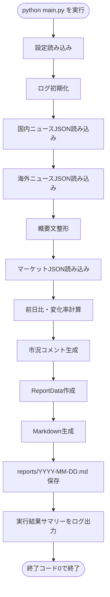
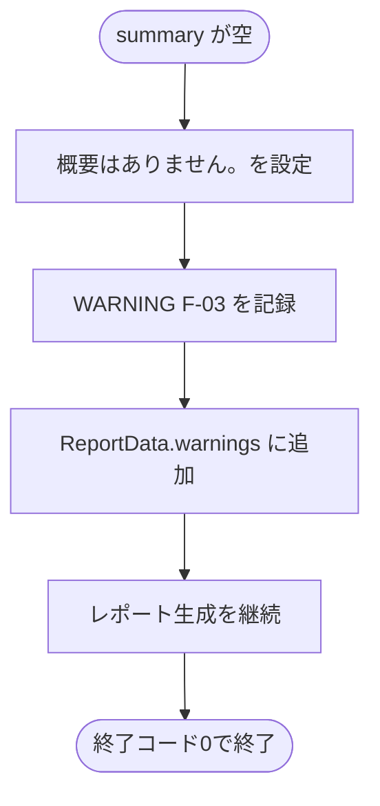
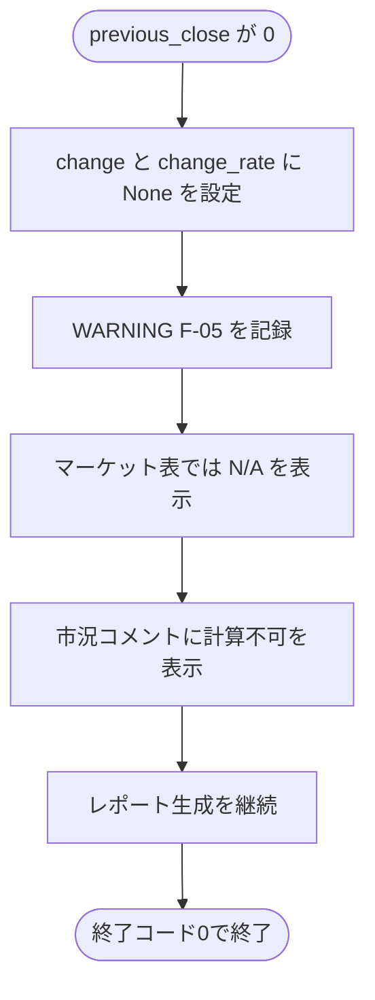
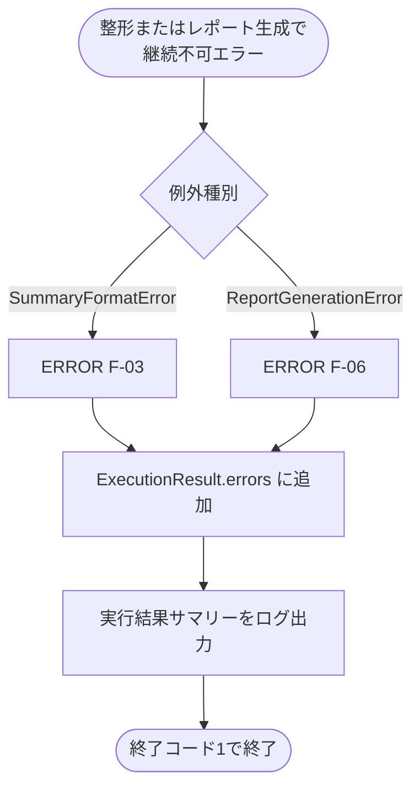

# Morning News 詳細設計 Phase 3

| Phase | 対象 | 完了条件 |
| --- | --- | --- |
| Phase 3 | 概要文整形・変化率計算追加 | ニュース概要と市況の変化率が整形される。 |

## 1. 詳細設計の目的

本書は、要件定義および基本設計で定義した `F-03 概要文整形` と `F-05 変化率計算` を中心に、Phase 3 で実装するニュース概要文の正規化、文字数制御、市況データの前日比・変化率計算、表示ルール、警告ログを具体化するための詳細設計書である。

Phase 1 では、`sample_data` からMarkdownレポートを生成・保存する最小機能を実装した。
Phase 2 では、ログ、例外、実行結果集計、終了コード制御を追加した。
Phase 3 では、Phase 2 のログ・例外基盤を前提に、レポート本文へ表示するニュース概要とマーケット情報の品質を高める。

Phase 3 の対象は、外部API取得ではなく、既存の `sample` モードで読み込んだデータをレポート表示向けに整える処理である。
AIによる高度な要約、翻訳、外部ニュース取得、価格API取得は扱わない。

## 2. Phase 3 の対象範囲

### 2.1 Phase 3 で実装する機能

| 対象 | 内容 |
| --- | --- |
| 概要文の空白正規化 | 改行、タブ、連続空白を単一スペースへ変換し、前後空白を除去する |
| 概要文の文字数制御 | `SUMMARY_MAX_LENGTH` を上限として `short_summary` を生成する |
| 概要文欠損時の代替表示 | `summary` が空の場合は `概要はありません。` を設定し、警告として記録する |
| 整形済みニュースデータ生成 | 元の `summary` を保持したまま、表示用の `short_summary` を追加する |
| 前日比計算 | `current_value - previous_close` を計算し、`change` に設定する |
| 変化率計算 | `change / previous_close * 100` を計算し、`change_rate` に設定する |
| 計算不可時の代替表示 | `previous_close == 0` の場合は `change` / `change_rate` を `None` とし、レポートでは `N/A` を表示する |
| 数値表示の整形 | 現在値、前日比、変化率を小数第2位まで表示する |
| 市況コメント生成 | 変化率に応じて中立的な定型コメントを生成する |
| 禁止表現の回避 | 売買推奨・投資助言と誤認される表現を使わない |
| ログ・警告連携 | 整形件数、計算件数、欠損概要、計算不可理由を Phase 2 のログ形式で記録する |

### 2.2 Phase 3 では実装しない機能

| 対象外 | 理由 |
| --- | --- |
| RSS/APIからの外部ニュース取得 | Phase 4 で実装する |
| 株価API・為替APIからの実データ取得 | Phase 4 で実装する |
| `.env` によるAPIキー読み込み | Phase 4 で実装する |
| pytestによる網羅的な自動テスト | Phase 5 で整備する |
| AI要約・本文全文解析 | MVP対象外。要件定義でも対象外としている |
| 海外ニュースの自動翻訳 | MVP対象外。取得元の概要文を整形して表示する |
| 変化率の重要度判定しきい値設定 | MVPでは正・負・ゼロ・計算不可の単純ルールに限定する |
| 売買判断、推奨、投資助言 | コンプライアンス要件により対象外とする |

### 2.3 基本設計との対応

| 基本設計の項目 | Phase 3 での具体化 |
| --- | --- |
| 5.4 ニュースデータの正規化 | `summary` から `short_summary` を生成する具体ルールを定義する |
| 5.5 マーケットデータの正規化 | `change` と `change_rate` の計算式、丸め、計算不可時の扱いを定義する |
| 8.3 表示ルール | 概要文、前日比、変化率、欠損データの表示形式を詳細化する |
| 8.4 市況コメント生成ルール | 変化率に応じた定型コメントと禁止表現を具体化する |
| 9. ログ設計 | `F-03` と `F-05` のINFO/WARNINGログを具体化する |
| 13. テスト方針 | 概要文整形と変化率計算の確認観点を定義する |
| 14. 実装フェーズ | Phase 3 の完了条件をレポート本文とログで判定できるようにする |

## 3. ファイル構成

Phase 3 では、Phase 2 で追加した `src/utils/` のログ・例外・実行結果集計を利用し、主にニュース整形、マーケット計算、レポート表示の既存ファイルを変更する。

```text
morning-news/
├── main.py
├── src/
│   ├── config/
│   │   └── settings.py
│   ├── news/
│   │   ├── fetcher.py
│   │   └── formatter.py
│   ├── market/
│   │   ├── fetcher.py
│   │   └── calculator.py
│   ├── report/
│   │   ├── generator.py
│   │   └── writer.py
│   └── utils/
│       ├── exceptions.py
│       ├── execution_result.py
│       └── logger.py
├── sample_data/
│   ├── news_jp.json
│   ├── news_global.json
│   └── market.json
├── reports/
└── logs/
    └── app.log
```

### 3.1 追加・変更対象ファイル

| ファイル | 区分 | 役割 |
| --- | --- | --- |
| `main.py` | 変更 | 概要文整形、変化率計算、警告記録、件数ログを呼び出す |
| `src/news/formatter.py` | 変更 | `format_summary()` と `format_news_items()` で表示用概要を生成する |
| `src/market/calculator.py` | 変更 | `calculate_change()` と `calculate_market_changes()` で前日比・変化率を計算する |
| `src/report/generator.py` | 変更 | 整形済み概要、市況表、市況コメント、`N/A` 表示を生成する |
| `src/config/settings.py` | 変更なしまたは確認 | `SUMMARY_MAX_LENGTH=120` を概要文上限として利用する |
| `src/utils/exceptions.py` | 変更なしまたは確認 | `SummaryFormatError` と `MarketCalculationError` を利用する |
| `src/utils/execution_result.py` | 変更なしまたは確認 | 警告件数、エラー件数、マーケットコメント件数を集計する |
| `src/utils/logger.py` | 変更なし | Phase 2 の機能ID付きログを利用する |

### 3.2 モジュール依存関係

Phase 3 の整形・計算処理は、取得済みデータを受け取り、レポート表示用データを返す純粋な変換処理として扱う。
各変換モジュールは `main.py` を参照しない。

```text
main.py
  ├── src/news/formatter.py
  │     ├── format_summary()
  │     └── format_news_items()
  ├── src/market/calculator.py
  │     ├── calculate_change()
  │     └── calculate_market_changes()
  └── src/report/generator.py
        ├── generate_news_section()
        ├── generate_market_section()
        └── generate_market_comments()
```

## 4. ニュース概要文整形設計

### 4.1 対象データ

Phase 3 では、`sample_data/news_jp.json` と `sample_data/news_global.json` から読み込んだニュースデータの `summary` を整形対象にする。

入力例:

```json
{
  "region": "domestic",
  "category": "economy",
  "title": "国内企業の決算発表を受け、市場に注目が集まる",
  "url": "https://example.com/jp-news-001",
  "source": "Sample JP News",
  "published_at": "2026-05-19T07:00:00+09:00",
  "summary": "国内主要企業の決算発表を受け、投資家の関心が業績見通しや為替影響に向いている。"
}
```

出力例:

```json
{
  "region": "domestic",
  "category": "economy",
  "title": "国内企業の決算発表を受け、市場に注目が集まる",
  "url": "https://example.com/jp-news-001",
  "source": "Sample JP News",
  "published_at": "2026-05-19T07:00:00+09:00",
  "summary": "国内主要企業の決算発表を受け、投資家の関心が業績見通しや為替影響に向いている。",
  "short_summary": "国内主要企業の決算発表を受け、投資家の関心が業績見通しや為替影響に向いている。"
}
```

### 4.2 整形ルール

| 条件 | 処理 | 例 |
| --- | --- | --- |
| 改行を含む | 改行を半角スペースへ変換する | `"A\nB"` -> `"A B"` |
| タブを含む | タブを半角スペースへ変換する | `"A\tB"` -> `"A B"` |
| 連続空白を含む | 連続空白を1つにまとめる | `"A   B"` -> `"A B"` |
| 前後空白を含む | 前後空白を削除する | `" A "` -> `"A"` |
| `summary` が `None` | 空文字として扱う | `None` -> `概要はありません。` |
| `summary` が空 | `概要はありません。` を設定する | `""` -> `概要はありません。` |
| 上限以内 | そのまま返す | 120文字以内なら変更しない |
| 上限超過 | 末尾を `...` で省略する | 117文字 + `...` |
| `max_length <= 0` | `SummaryFormatError` を送出する | 設定不正として停止 |

### 4.3 文字数上限

| 項目 | 値 |
| --- | ---: |
| 設定名 | `SUMMARY_MAX_LENGTH` |
| Phase 3 の仮置き値 | `120` |
| 参照箇所 | `settings["summary_max_length"]` |
| 対象 | `short_summary` |

`summary` の原文は保持し、レポート表示には `short_summary` を利用する。
上限値は Phase 4 以降で環境変数化する可能性があるが、Phase 3 では固定値を使用する。

### 4.4 省略記号ルール

概要文が上限を超える場合は、表示上限内に収まるよう末尾に `...` を付与する。
`max_length` は、省略記号を含めた最終文字数の上限とする。

| `max_length` | 処理 |
| ---: | --- |
| `120` | 先頭117文字 + `...` |
| `4` | 先頭1文字 + `...` |
| `3` | 本文0文字 + `...` |
| `1` から `2` | `.` を上限文字数分返す |
| `0` 以下 | `SummaryFormatError` |

`max_length >= 3` の場合は、本文を `max_length - 3` 文字に切り詰めて `...` を付与する。
`max_length < 3` の場合は、`...` 自体が上限を超えるため、`.` を `max_length` 個返す。
`max_length <= 0` の場合は `SummaryFormatError` とする。

### 4.5 `format_summary()`

| 項目 | 内容 |
| --- | --- |
| 配置 | `src/news/formatter.py` |
| 入力 | `summary: str`, `max_length: int` |
| 出力 | `str` |
| 機能ID | `F-03` |
| 処理名 | `news.formatter` |

処理順序:

1. `max_length <= 0` の場合は `SummaryFormatError` を送出する。
2. `summary` が `None` または空の場合は空文字として扱う。
3. `str(summary or "")` で文字列化する。
4. 正規表現 `\s+` に一致する空白群を半角スペースへ変換する。
5. 前後空白を除去する。
6. 空文字になった場合は `概要はありません。` を返す。
7. `len(normalized) <= max_length` の場合はそのまま返す。
8. `max_length >= 3` の場合は `normalized[: max_length - 3].rstrip() + "..."` を返す。
9. `max_length < 3` の場合は `.` を `max_length` 個返す。

### 4.6 `format_news_items()`

| 項目 | 内容 |
| --- | --- |
| 配置 | `src/news/formatter.py` |
| 入力 | `items: list[dict]`, `max_length: int` |
| 出力 | `list[dict]` |
| 機能ID | `F-03` |
| 処理名 | `news.formatter` |

処理順序:

1. 入力リストを順に処理する。
2. 各 `item` を浅いコピーする。
3. `format_summary(item.get("summary", ""), max_length)` を呼び出す。
4. 戻り値を `short_summary` に設定する。
5. 整形済みリストへ追加する。
6. 元の `items` は破壊的に変更しない。

### 4.7 概要文欠損時の警告

概要文欠損は、レポート生成を止めない継続可能な警告として扱う。
Phase 3 では、概要文欠損の検出場所を `main.py` に統一する。
`format_summary()` は代替文を返すだけにし、ログ出力や `ExecutionResult` への警告追加は行わない。
`format_news_items()` も警告情報を返さず、整形済みニュース一覧のみを返す。

| 条件 | 動作 | ログ | レポート表示 |
| --- | --- | --- | --- |
| `summary` が空 | `概要はありません。` を設定 | `WARNING F-03` | `概要はありません。` |
| `summary` が空白のみ | `概要はありません。` を設定 | `WARNING F-03` | `概要はありません。` |
| `summary` が `None` | `概要はありません。` を設定 | `WARNING F-03` | `概要はありません。` |

`main.py` は、`format_news_items()` を呼び出す前に元データの `summary` を確認する。
これにより、整形後に `short_summary` が `概要はありません。` になった理由を呼び出し元で記録できる。

```python
for index, item in enumerate(domestic_news):
    if not str(item.get("summary", "")).strip():
        record_recoverable_warning(
            logger,
            result,
            "F-03",
            "news.formatter",
            f"domestic_news[{index}] の summary が空のため代替文を設定しました",
        )
```

ログ例:

```text
2026-05-23 07:00:00 WARNING F-03 news.formatter domestic_news[2] の summary が空のため代替文を設定しました
```

## 5. マーケット変化率計算設計

### 5.1 対象データ

Phase 3 では、`sample_data/market.json` から読み込んだ日本市場参考指標、米国市場参考指標、USD/JPY を最低対象とする。

入力例:

```json
{
  "symbol": "NIKKEI225",
  "name": "日本市場参考指標",
  "current_value": 38500.25,
  "previous_close": 38200.0,
  "unit": "points",
  "fetched_at": "2026-05-19T07:00:00+09:00"
}
```

出力例:

```json
{
  "symbol": "NIKKEI225",
  "name": "日本市場参考指標",
  "current_value": 38500.25,
  "previous_close": 38200.0,
  "change": 300.25,
  "change_rate": 0.79,
  "unit": "points",
  "fetched_at": "2026-05-19T07:00:00+09:00"
}
```

### 5.2 計算式

| 項目 | 計算式 | 丸め |
| --- | --- | --- |
| 前日比 `change` | `current_value - previous_close` | 小数第2位 |
| 変化率 `change_rate` | `(current_value - previous_close) / previous_close * 100` | 小数第2位 |

計算例:

| 指標 | 現在値 | 前日終値 | 前日比 | 変化率 |
| --- | ---: | ---: | ---: | ---: |
| 日本市場参考指標 | `38500.25` | `38200.00` | `300.25` | `0.79` |
| 米国市場参考指標 | `5250.10` | `5200.00` | `50.10` | `0.96` |
| USD/JPY | `155.20` | `154.80` | `0.40` | `0.26` |

### 5.3 `previous_close` の扱い

基本設計では、`previous_close` はマーケットデータの任意項目として定義している。
ただし Phase 3 の変化率計算では、`previous_close` がないと `change` と `change_rate` を算出できない。
そのため、算出できない項目は `change=None`、`change_rate=None` とし、レポートでは `N/A`、ログでは `WARNING F-05` として扱う。

| 条件 | Phase 3 の扱い |
| --- | --- |
| `previous_close` が欠損 | 計算不可として `change=None`、`change_rate=None` を設定し、`WARNING F-05` を出して継続する |
| `previous_close` が非数値 | 計算不可として `change=None`、`change_rate=None` を設定し、`WARNING F-05` を出して継続する |
| `previous_close == 0` | 計算不可として `change=None`、`change_rate=None` を設定し、`WARNING F-05` を出して継続する |
| `previous_close` が数値かつ0以外 | 前日比・変化率を計算する |

これにより、一部指標の欠損でレポート全体を止めず、利用者が欠損理由を確認できる。

### 5.4 数値判定

| 条件 | 判定 |
| --- | --- |
| `int` | 数値として扱う |
| `float` | 数値として扱う |
| `bool` | 数値として扱わない |
| `str` | 数値として扱わない |
| `None` | 数値として扱わない |

`bool` は Python では `int` のサブクラスだが、マーケット価格として扱うと誤判定になるため除外する。

### 5.5 `calculate_change()`

| 項目 | 内容 |
| --- | --- |
| 配置 | `src/market/calculator.py` |
| 入力 | `current_value: float`, `previous_close: float` |
| 出力 | `tuple[float | None, float | None]` |
| 機能ID | `F-05` |
| 処理名 | `market.calculator` |

処理順序:

1. `current_value` と `previous_close` が数値か確認する。
2. 数値でない場合は `MarketCalculationError` を送出する。
3. `previous_close == 0` の場合は `(None, None)` を返す。
4. `raw_change = current_value - previous_close` を計算する。
5. `change = round(raw_change, 2)` を設定する。
6. `change_rate = round(raw_change / previous_close * 100, 2)` を設定する。
7. `(change, change_rate)` を返す。

### 5.6 `calculate_market_changes()`

| 項目 | 内容 |
| --- | --- |
| 配置 | `src/market/calculator.py` |
| 入力 | `items: list[dict]` |
| 出力 | `list[dict]` |
| 機能ID | `F-05` |
| 処理名 | `market.calculator` |

処理順序:

1. 入力リストを順に処理する。
2. 各 `item` を浅いコピーする。
3. `current_value` と `previous_close` を取り出す。
4. 必須キーがない場合は `change=None`、`change_rate=None` とし、`calculation_warning` を設定する。
5. `calculate_change()` を呼び出す。
6. 型不正や `previous_close == 0` で計算できない場合は `change=None`、`change_rate=None` とし、`calculation_warning` を設定する。
7. 戻り値を `change` と `change_rate` に設定する。
8. 計算済みリストへ追加する。
8. 元の `items` は破壊的に変更しない。

### 5.7 計算不可時の扱い

| 条件 | 動作 | ログ | レポート表示 | 終了コード |
| --- | --- | --- | --- | ---: |
| `previous_close == 0` | `change=None`, `change_rate=None` | `WARNING F-05` | `N/A` | `0` |
| `current_value` が非数値 | `change=None`, `change_rate=None` | `WARNING F-05` | `N/A` | `0` |
| `previous_close` が非数値 | `change=None`, `change_rate=None` | `WARNING F-05` | `N/A` | `0` |
| 必須キー欠損 | `change=None`, `change_rate=None` | `WARNING F-05` | `N/A` | `0` |

マーケットデータの一部欠損は、レポート全体を止めるほどではないため、警告として処理を継続する。

ログ例:

```text
2026-05-23 07:00:00 WARNING F-05 market.calculator USD/JPY は previous_close が 0 のため変化率を計算できませんでした
```

## 6. レポート表示設計

### 6.1 ニュース表示

ニュースセクションでは、整形済みの `short_summary` を表示する。
`short_summary` が存在しない場合は、レポート生成側で `概要はありません。` をフォールバック表示する。

```markdown
### 1. 国内企業の決算発表を受け、市場に注目が集まる
- 配信元: Sample JP News
- 公開日時: 2026-05-19T07:00:00+09:00
- 概要: 国内主要企業の決算発表を受け、投資家の関心が業績見通しや為替影響に向いている。
- URL: https://example.com/jp-news-001
```

### 6.2 マーケット表表示

マーケット情報はMarkdown表で表示する。
前日比と変化率は符号付きで表示する。

```markdown
| 指標 | 現在値 | 前日比 | 変化率 | 取得日時 |
| --- | ---: | ---: | ---: | --- |
| 日本市場参考指標 | 38500.25 points | +300.25 | +0.79% | 2026-05-19T07:00:00+09:00 |
| 米国市場参考指標 | 5250.10 points | +50.10 | +0.96% | 2026-05-19T07:00:00+09:00 |
| USD/JPY | 155.20 yen | +0.40 | +0.26% | 2026-05-19T07:00:00+09:00 |
```

### 6.3 数値フォーマット

| 関数 | 入力 | 出力例 | 用途 |
| --- | --- | --- | --- |
| `_format_number(value)` | `38500.25` | `38500.25` | 現在値 |
| `_format_number(value)` | `None` | `N/A` | 欠損値 |
| `_format_signed_number(value)` | `300.25` | `+300.25` | 前日比 |
| `_format_signed_number(value)` | `-50.1` | `-50.10` | 前日比 |
| `_format_rate(value)` | `0.79` | `+0.79%` | 変化率 |
| `_format_rate(value)` | `None` | `N/A` | 計算不可 |

### 6.4 今日の注目ポイント

`## 1. 今日の注目ポイント` では、整形・計算後のデータから以下を表示する。

| 表示項目 | データ |
| --- | --- |
| 国内 | `news_domestic[0]["title"]` |
| 海外 | `news_global[0]["title"]` |
| 市況 | `markets[0]["name"]` と `markets[0]["change_rate"]` |

表示例:

```markdown
- 国内: 国内企業の決算発表を受け、市場に注目が集まる
- 海外: US technology stocks move higher as AI demand remains in focus
- 市況: 日本市場参考指標は前日比 +0.79%
```

### 6.5 市況コメント

市況コメントは、変化率を説明する中立的な定型文に限定する。
売買判断、価格予測、投資助言に見える表現は使用しない。
市況コメントは `markets` の各要素につき1件生成する。
生成結果は `ReportData["comments"]` に `list[str]` として格納し、レポート生成ではこの `comments` を表示する。

| 条件 | コメント |
| --- | --- |
| `change_rate is None` | `<指標名>は変化率を計算できませんでした。` |
| `change_rate > 0` | `<指標名>は前日比で上昇傾向です。` |
| `change_rate < 0` | `<指標名>は前日比で下落傾向です。` |
| `change_rate == 0` | `<指標名>は前日比で大きな変動は見られません。` |

禁止表現:

- 買うべき
- 売るべき
- 今が買い時
- 必ず上がる
- 投資すべき
- 利益が出る

### 6.6 注意事項

レポート末尾には、必ず以下を表示する。

```text
本レポートは情報提供を目的としており、投資助言ではありません。
```

## 7. ログ設計

Phase 3 では、Phase 2 で定義したログ形式をそのまま利用する。

```text
YYYY-MM-DD HH:mm:ss LEVEL FEATURE_ID PROCESS_NAME MESSAGE
```

### 7.1 機能ID

| 機能ID | 対象 | 主なログ |
| --- | --- | --- |
| `F-03` | 概要文整形 | 概要文整形件数、概要文欠損警告、設定値不正 |
| `F-05` | 変化率計算 | 変化率計算開始、計算件数、計算不可警告、型不正 |
| `F-07` | 市況コメント | 市況コメント生成件数 |
| `F-09` | エラーログ | 警告件数、エラー件数、実行結果サマリー |

### 7.2 ログ出力タイミング

| 処理 | レベル | 機能ID | メッセージ例 |
| --- | --- | --- | --- |
| 概要文整形完了 | `INFO` | `F-03` | `ニュース概要文整形件数: 6` |
| 概要文欠損 | `WARNING` | `F-03` | `domestic_news[2] の summary が空のため代替文を設定しました` |
| 変化率計算開始 | `INFO` | `F-05` | `変化率計算を開始します` |
| 変化率計算完了 | `INFO` | `F-05` | `変化率計算件数: 3` |
| 変化率計算不可 | `WARNING` | `F-05` | `USD/JPY は previous_close が 0 のため変化率を計算できませんでした` |
| 市況コメント生成完了 | `INFO` | `F-07` | `市況コメント生成件数: 3` |
| 実行結果サマリー | `INFO` / `WARNING` / `ERROR` | `F-09` | `実行結果: status=warning warnings=1 errors=0 news_domestic=3 news_global=3 markets=3` |

### 7.3 警告の記録先

継続可能な警告は、以下の両方へ記録する。

| 記録先 | 内容 |
| --- | --- |
| `logs/app.log` | 機能ID、処理名、警告理由 |
| `ReportData["warnings"]` | レポート本文の `### 警告` に表示する短い説明 |

レポート本文へは、内部パスやスタックトレースを出さない。
利用者が理解できる範囲の短い理由にする。

## 8. エラー処理設計

### 8.1 概要文整形

| 条件 | 例外 | 継続 | ログ | 終了コード |
| --- | --- | --- | --- | ---: |
| `summary` が空 | なし | 継続 | `WARNING F-03` | `0` |
| `summary` が `None` | なし | 継続 | `WARNING F-03` | `0` |
| `max_length <= 0` | `SummaryFormatError` | 停止 | `ERROR F-03` | `1` |

### 8.2 変化率計算

| 条件 | 例外 | 継続 | ログ | 終了コード |
| --- | --- | --- | --- | ---: |
| `previous_close == 0` | なし | 継続 | `WARNING F-05` | `0` |
| `current_value` が非数値 | なし | 継続 | `WARNING F-05` | `0` |
| `previous_close` が非数値 | なし | 継続 | `WARNING F-05` | `0` |
| `current_value` 欠損 | なし | 継続 | `WARNING F-05` | `0` |
| `previous_close` 欠損 | なし | 継続 | `WARNING F-05` | `0` |

### 8.3 継続可能な警告

Phase 3 の継続可能な警告は以下とする。

- 概要文が空のため代替文を設定した。
- 前営業日終値が `0` のため変化率を計算できなかった。

これらはレポート保存まで処理を継続し、実行結果ステータスは `warning` とする。
終了コードは `0` とする。

### 8.4 停止するエラー

Phase 3 の停止対象は以下とする。

- `SUMMARY_MAX_LENGTH` が `0` 以下。
- レポート生成時に必須キーが欠損している。

これらはレポートの正確性を担保できないため、Phase 2 の例外処理に従って `ERROR` ログを出し、終了コード `1` を返す。

## 9. `ReportData` への反映

Phase 3 の `ReportData` は、Phase 2 の構造を維持しつつ、整形済みのニュースと計算済みのマーケット情報を格納する。
キー名は `news_domestic` / `news_global` に統一する。
`jp_news` / `global_news` のような別名は使わない。
市況コメントは `comments`、警告は `warnings`、致命的なエラーは `errors` に分けて保持する。

```python
{
    "generated_at": "2026-05-23 07:00 JST",
    "mode": "sample",
    "news_domestic": [
        {
            "region": "domestic",
            "category": "economy",
            "title": "...",
            "url": "...",
            "source": "...",
            "published_at": "...",
            "summary": "...",
            "short_summary": "..."
        }
    ],
    "news_global": [
        {
            "region": "global",
            "category": "market",
            "title": "...",
            "url": "...",
            "source": "...",
            "published_at": "...",
            "summary": "...",
            "short_summary": "..."
        }
    ],
    "markets": [
        {
            "symbol": "NIKKEI225",
            "name": "日本市場参考指標",
            "current_value": 38500.25,
            "previous_close": 38200.0,
            "change": 300.25,
            "change_rate": 0.79,
            "unit": "points",
            "fetched_at": "2026-05-19T07:00:00+09:00"
        }
    ],
    "comments": [
        "日本市場参考指標は前日比で上昇傾向です。"
    ],
    "warnings": [],
    "errors": [],
    "disclaimer": "本レポートは情報提供を目的としており、投資助言ではありません。",
    "execution_summary": {}
}
```

### 9.1 `ReportData` キー

| キー | 型 | 説明 |
| --- | --- | --- |
| `generated_at` | `str` | レポート生成日時 |
| `mode` | `str` | Phase 3 では `sample` |
| `news_domestic` | `list[dict]` | 国内ニュース。`short_summary` を含む |
| `news_global` | `list[dict]` | 海外ニュース。`short_summary` を含む |
| `markets` | `list[dict]` | 計算済みマーケット情報。`change` と `change_rate` を含む |
| `comments` | `list[str]` | `markets` の各要素につき1件生成した市況コメント |
| `warnings` | `list[str]` | レポート本文にも表示する継続可能な警告 |
| `errors` | `list[str]` | レポート保存まで到達しない致命的エラーの要約。通常は空配列 |
| `disclaimer` | `str` | 投資助言ではない旨の注意事項 |
| `execution_summary` | `dict` | ログと確認用の実行結果概要 |

`errors` は主に構造統一のために保持する。
致命的なエラーがある場合はレポート保存まで到達しないため、通常のレポート本文には表示しない。

### 9.2 ニュースデータ

| 項目 | 型 | Phase 3 の扱い |
| --- | --- | --- |
| `summary` | `str` | 原文を保持する |
| `short_summary` | `str` | レポート表示用に生成する |

### 9.3 マーケットデータ

| 項目 | 型 | Phase 3 の扱い |
| --- | --- | --- |
| `current_value` | `int` / `float` | 入力値を保持する |
| `previous_close` | `int` / `float` | 入力値を保持する |
| `change` | `float` / `None` | Phase 3 で追加する |
| `change_rate` | `float` / `None` | Phase 3 で追加する |

## 10. 処理順序

### 10.1 正常系



### 10.2 概要文欠損時



### 10.3 変化率計算不可時



### 10.4 異常系



## 11. 関数設計

### 11.1 `main.py`

| 関数 | Phase 3 の役割 |
| --- | --- |
| `build_report_data(settings, logger, result)` | ニュース整形、変化率計算、警告記録、件数集計をまとめる |
| `record_recoverable_warning(logger, result, feature_id, process_name, message)` | 継続可能な警告をログと実行結果に記録する |

`build_report_data()` の Phase 3 処理:

1. 国内ニュースを読み込む。
2. 海外ニュースを読み込む。
3. 整形前のニュースを確認し、概要文欠損があれば `record_recoverable_warning()` を呼ぶ。
4. `format_news_items()` で概要文を整形する。
5. マーケット情報を読み込む。
6. `calculate_market_changes()` で前日比・変化率を計算する。
7. `change_rate is None` の指標があれば `record_recoverable_warning()` を呼ぶ。
8. `generate_market_comments()` を呼び、`comments` とコメント件数を作る。
9. `news_domestic`、`news_global`、`markets`、`comments`、`warnings`、`errors`、`disclaimer` を含む `ReportData` を返す。

### 11.2 `src/news/formatter.py`

| 関数 | 入力 | 出力 | 処理内容 |
| --- | --- | --- | --- |
| `format_summary(summary, max_length)` | `str`, `int` | `str` | 空白正規化、空概要の代替、文字数上限の適用 |
| `format_news_items(items, max_length)` | `list[dict]`, `int` | `list[dict]` | 各ニュースへ `short_summary` を追加する。警告情報は返さない |

定数:

| 定数 | 値 | 用途 |
| --- | --- | --- |
| `NO_SUMMARY_TEXT` | `概要はありません。` | 概要文欠損時の代替表示 |
| `PROCESS_NAME` | `news.formatter` | ログ・例外用処理名 |

### 11.3 `src/market/calculator.py`

| 関数 | 入力 | 出力 | 処理内容 |
| --- | --- | --- | --- |
| `_is_number(value)` | 任意 | `bool` | `int` / `float` かつ `bool` でないことを判定する |
| `calculate_change(current_value, previous_close)` | `float`, `float` | `tuple[float | None, float | None]` | 前日比と変化率を計算する |
| `calculate_market_changes(items)` | `list[dict]` | `list[dict]` | 各マーケット項目へ `change` と `change_rate` を追加する |

定数:

| 定数 | 値 | 用途 |
| --- | --- | --- |
| `FEATURE_ID` | `F-05` | 変化率計算の機能ID |
| `PROCESS_NAME` | `market.calculator` | ログ・例外用処理名 |

### 11.4 `src/report/generator.py`

| 関数 | Phase 3 の役割 |
| --- | --- |
| `_format_number(value)` | 現在値または欠損値を表示用文字列へ変換する |
| `_format_signed_number(value)` | 前日比を符号付き小数第2位で表示する |
| `_format_rate(value)` | 変化率を符号付きパーセントで表示する |
| `generate_news_section(title, items)` | `short_summary` をニュース概要として表示する |
| `generate_market_section(items)` | `change` と `change_rate` をMarkdown表に表示する |
| `generate_market_comments(items)` | `markets` の各要素につき1件、変化率に応じた中立的コメントを生成する |
| `generate_report(report_data)` | 整形済みニュース、計算済みマーケット、市況コメント、警告、注意事項を含むMarkdownを生成する |

## 12. 確認観点

### 12.1 正常系確認

| 確認内容 | 期待結果 |
| --- | --- |
| `python main.py` を実行する | 終了コード `0` で終了する |
| レポートのニュース概要を確認する | 改行や連続空白が除去されている |
| レポートのニュース概要を確認する | `short_summary` が `120` 文字以内で表示される |
| レポートのマーケット表を確認する | 前日比と変化率が表示される |
| レポートのマーケット表を確認する | 前日比と変化率が小数第2位で表示される |
| ログを確認する | `INFO F-03` と `INFO F-05` が出力される |
| 実行結果サマリーを確認する | `status=success` が出力される |

### 12.2 概要文整形の境界値確認

| 条件 | 期待結果 |
| --- | --- |
| `summary` が空文字 | `概要はありません。` が表示され、`WARNING F-03` が出る |
| `summary` が空白のみ | `概要はありません。` が表示され、`WARNING F-03` が出る |
| `summary` に改行がある | 改行が半角スペースへ変換される |
| `summary` に連続空白がある | 空白が1つにまとめられる |
| `summary` が120文字ちょうど | 省略されずに表示される |
| `summary` が121文字以上 | 末尾が `...` で省略される |
| `max_length == 3` | `...` が返る |
| `max_length == 1` | `.` が返る |
| `max_length == 0` | `SummaryFormatError` が発生する |

### 12.3 変化率計算の境界値確認

| 条件 | 期待結果 |
| --- | --- |
| `current_value > previous_close` | 正の `change` と `change_rate` が設定される |
| `current_value < previous_close` | 負の `change` と `change_rate` が設定される |
| `current_value == previous_close` | `change=0.0`, `change_rate=0.0` が設定される |
| `previous_close == 0` | `change=None`, `change_rate=None` となり、`WARNING F-05` が出る |
| `current_value` が文字列 | `change=None`, `change_rate=None` となり、`WARNING F-05` が出る |
| `previous_close` が文字列 | `change=None`, `change_rate=None` となり、`WARNING F-05` が出る |
| `current_value` が `True` | `change=None`, `change_rate=None` となり、`WARNING F-05` が出る |
| `previous_close` が欠損 | `change=None`, `change_rate=None` となり、`WARNING F-05` が出る |
| `previous_close` が `None` | `change=None`, `change_rate=None` となり、`WARNING F-05` が出る |

### 12.4 レポート表示確認

| 確認内容 | 期待結果 |
| --- | --- |
| `short_summary` が存在する | `概要:` に `short_summary` が表示される |
| `change_rate` が正 | `+0.79%` のように符号付きで表示される |
| `change_rate` が負 | `-0.79%` のように符号付きで表示される |
| `change_rate` が `None` | `N/A` と表示される |
| `unit` がある | `38500.25 points` のように単位付きで表示される |
| `unit` が空 | 数値のみ表示される |

### 12.5 市況コメント確認

| 条件 | 期待結果 |
| --- | --- |
| 変化率が正 | `前日比で上昇傾向です。` を表示する |
| 変化率が負 | `前日比で下落傾向です。` を表示する |
| 変化率が0 | `前日比で大きな変動は見られません。` を表示する |
| 変化率が `None` | `変化率を計算できませんでした。` を表示する |
| `markets` が3件 | `comments` も3件生成される |
| レポート末尾 | `本レポートは情報提供を目的としており、投資助言ではありません。` を表示する |
| 禁止表現確認 | `買うべき`、`売るべき`、`今が買い時` などが含まれない |

## 13. 実装手順

Phase 3 は、以下の順番で実装・確認する。

1. `settings.py` の `SUMMARY_MAX_LENGTH` が `120` であることを確認する。
2. `src/news/formatter.py` の `format_summary()` で空白正規化、空概要代替、文字数制御を実装する。
3. `src/news/formatter.py` の `format_news_items()` で `short_summary` を追加する。
4. `main.py` で整形前のニュースから概要文欠損を検出し、`WARNING F-03` として記録する。
5. `src/market/calculator.py` の `calculate_change()` で前日比・変化率を計算する。
6. `src/market/calculator.py` の `calculate_market_changes()` で各指標へ `change` と `change_rate` を追加する。
7. `main.py` でマーケット計算不可を `WARNING F-05` として記録する。
8. `main.py` で `comments`、`warnings`、`errors`、`disclaimer` を含む `ReportData` を作る。
9. `src/report/generator.py` で `short_summary`、前日比、変化率、`comments`、`N/A` を表示する。
10. `generate_market_comments()` の禁止表現を確認する。
11. `python main.py` を実行し、`reports/YYYY-MM-DD.md` と `logs/app.log` を確認する。

## 14. 受け入れ条件

Phase 3 は、以下を満たしたら完了とする。

- `python main.py` を実行すると、終了コード `0` で `reports/YYYY-MM-DD.md` が作成または更新される。
- 国内ニュースと海外ニュースの各項目に、整形済みの `short_summary` が生成される。
- レポートの概要文では、不要改行、タブ、重複空白が除去される。
- レポートの概要文は `SUMMARY_MAX_LENGTH` 以内に収まる。
- 概要文が空の場合、`概要はありません。` が表示され、`WARNING F-03` がログに残る。
- マーケット情報の各項目に、`change` と `change_rate` が追加される。
- マーケット計算に必要な値が欠損または型不正の場合、レポートでは `N/A` が表示され、`WARNING F-05` がログに残る。
- レポートの前日比と変化率は、小数第2位かつ符号付きで表示される。
- `previous_close == 0` の場合、レポートでは `N/A` が表示され、`WARNING F-05` がログに残る。
- `markets` の各要素につき1件の市況コメントが `ReportData["comments"]` に生成される。
- 市況コメントは、上昇傾向、下落傾向、大きな変動なし、計算不可のいずれかの定型表現で表示される。
- 市況コメントと注意事項に、投資助言と誤認される禁止表現が含まれない。
- `logs/app.log` に `INFO F-03`、`INFO F-05`、必要に応じて `WARNING F-03` / `WARNING F-05` が出力される。
- 警告がある場合もレポート保存まで完了し、終了コードは `0` になる。
- `SUMMARY_MAX_LENGTH <= 0` の場合は、`ERROR` ログを出して終了コード `1` になる。

## 15. 次フェーズで追加するもの

Phase 3 では、既存の `sample` データを表示向けに整形・計算する。
以下は次フェーズ以降で追加する。

| フェーズ | 追加内容 |
| --- | --- |
| Phase 4 | RSS/API取得、マーケットAPI取得、`.env` 読み込み、APIキー未設定時の警告ログ |
| Phase 5 | pytestによる概要文整形、変化率計算、レポート生成、異常系の自動テスト |
| Phase 6 | README、`.env.example`、サンプルレポート、公開前チェック |

Phase 3 完了時点では、外部API通信、APIキー管理、定時実行、通知、Web UI は実装しない。
