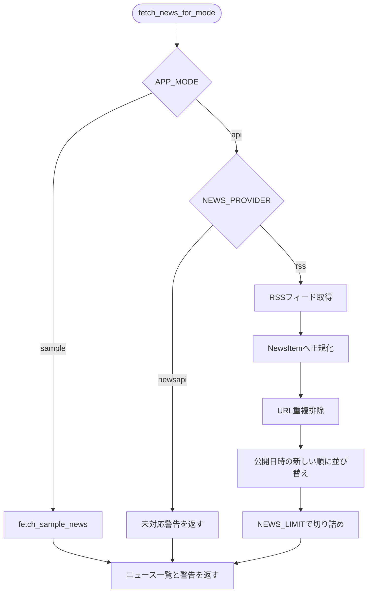
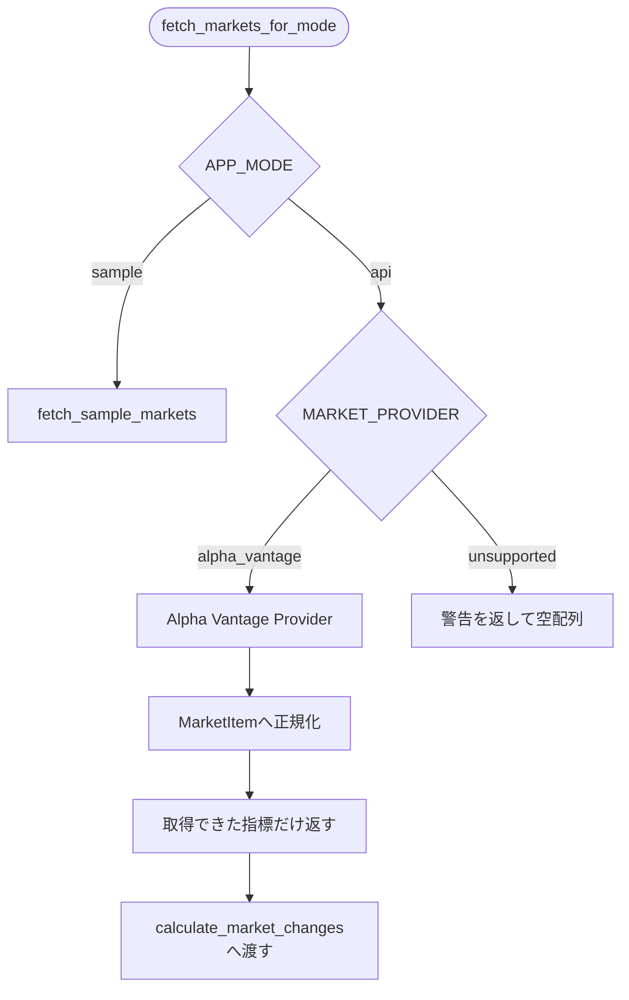
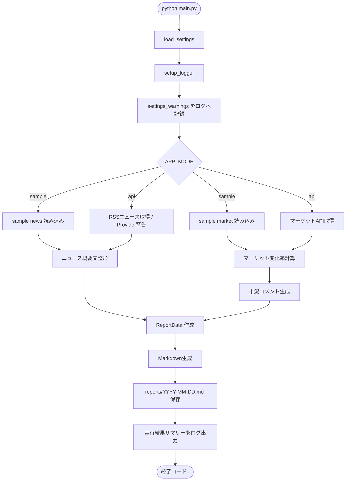

# Morning News 詳細設計 Phase 4

| Phase | 対象 | 完了条件 |
| --- | --- | --- |
| Phase 4 | RSS/API取得追加 | `APP_MODE=api` で外部データを取得し、既存のMarkdownレポート生成処理へ接続できる。 |

## 1. 詳細設計の目的

本書は、要件定義および基本設計で定義した `F-01 国内ニュース取得`、`F-02 海外ニュース取得`、`F-04 マーケット情報取得`、`F-10 サンプル実行` を中心に、Phase 4 で実装する `.env` 読み込み、`APP_MODE=api`、RSS/APIからのニュース取得、マーケットAPI取得、APIキー未設定時の警告ログを具体化するための詳細設計書である。

Phase 1 では、`sample_data` からMarkdownレポートを生成・保存する最小機能を実装した。
Phase 2 では、ログ、例外、実行結果集計、終了コード制御を追加した。
Phase 3 では、ニュース概要文整形、マーケット変化率計算、市況コメント生成を追加した。

Phase 4 では、これまで `sample` 固定だった入力データ取得を `sample` / `api` の2系統に分ける。
`sample` モードの動作はポートフォリオ確認用として維持し、`api` モードでは外部RSS/APIから取得したデータを既存の `NewsItem` / `MarketItem` に正規化して、Phase 3 までの整形・計算・レポート生成処理へ渡す。

## 2. Phase 4 の対象範囲

### 2.1 Phase 4 で実装する機能

| 対象 | 内容 |
| --- | --- |
| `.env` 読み込み | `.env` と環境変数から実行モード、APIキー、RSS URL、外部取得設定を読み込む |
| 実行モード分岐 | `APP_MODE=sample` と `APP_MODE=api` でデータ取得経路を切り替える |
| RSSニュース取得 | RSS/Atomフィードから国内・海外ニュースを取得し、`NewsItem` に正規化する |
| ニュースAPI拡張口 | `NEWS_PROVIDER` 設定により、後続でニュースAPI取得を差し替え可能にする。Phase 4 の必須実装はRSS Providerとする |
| マーケットAPI取得 | 外部マーケットAPIから日経平均、S&P500、USD/JPY相当のデータを取得し、`MarketItem` に正規化する |
| HTTP共通処理 | タイムアウト、リトライ、HTTPステータス確認、レスポンス解析、機密情報マスクを共通化する |
| 外部データ正規化 | 取得元ごとの差異を吸収し、既存の `format_news_items()` / `calculate_market_changes()` へ渡せる形にする |
| 部分失敗時の継続 | 一部フィード/API失敗時は警告を残し、取得できた範囲でレポート生成を継続する |
| APIキー未設定時の警告 | APIキーがない場合は該当API取得をスキップし、`WARNING` ログと `ReportData["warnings"]` に理由を残す |
| 機密情報保護 | APIキー、認証ヘッダー、クエリ付き認証URLをログ・レポートに出力しない |
| 依存関係追加 | `requests`、`feedparser`、`python-dotenv` を `requirements.txt` に追加する |

### 2.2 Phase 4 では実装しない機能

| 対象外 | 理由 |
| --- | --- |
| pytestによる網羅的な自動テスト | Phase 5 で整備する |
| 定時実行 | README整備または後続フェーズで扱う |
| AI要約・翻訳 | MVP対象外。取得元の概要文を整形する方針を維持する |
| ニュース本文全文取得 | 要件定義で対象外。RSS/APIのタイトル・URL・概要文のみ扱う |
| 有料記事・ログイン後ページ取得 | 公開リポジトリと利用規約上のリスクを避けるため対象外 |
| 自動売買シグナル | 要件定義で対象外。投資助言と誤認される表現は使わない |
| APIレスポンス全文保存 | 機密情報・利用規約・著作権リスクを避けるため保存しない |
| ログローテーション | MVPでは必須にしない |
| Web UI | MVP対象外 |

### 2.3 基本設計との対応

| 基本設計の項目 | Phase 4 での具体化 |
| --- | --- |
| 3. 実行モード設計 | `APP_MODE` を `.env` / 環境変数から読み込み、`sample` / `api` を分岐する |
| 5. データ取得・正規化設計 | RSS/APIレスポンスを `NewsItem` / `MarketItem` へ変換する |
| 9. ログ設計 | 外部取得の開始、成功件数、部分失敗、APIキー未設定、機密情報マスクを詳細化する |
| 10. エラー処理方針 | 外部取得失敗の継続可否、全取得失敗時の終了コードを詳細化する |
| 12. 設定・環境変数設計 | `.env.example` に Phase 4 の設定値を追加する |
| 13. テスト方針 | Phase 4 の手動確認観点と、Phase 5 で自動化する観点を整理する |
| 14. 実装フェーズ | Phase 4 の完了条件を `APP_MODE=api` のレポート生成で判定できるようにする |

## 3. Phase 4 の基本方針

### 3.1 `sample` モードを壊さない

`APP_MODE` が未設定、または `sample` の場合は、Phase 3 までと同じく `sample_data/*.json` からレポートを生成する。
Phase 4 で外部取得処理を追加しても、APIキーなしで第三者が動作確認できる状態を維持する。

| 条件 | 動作 |
| --- | --- |
| `APP_MODE` 未設定 | `sample` として実行する |
| `APP_MODE=sample` | `sample_data/*.json` を読み込む |
| `APP_MODE=api` | RSS/APIから外部データを取得する |
| `APP_MODE` がその他 | `sample` にフォールバックし、`WARNING F-10` を出す |

### 3.2 外部取得は取得元ごとに失敗を閉じ込める

RSS/APIは、通信失敗、API制限、レスポンス形式変更、キー未設定が起きる前提で扱う。
1つの取得元が失敗しても、他の取得元とレポート生成を可能な範囲で継続する。

| 失敗単位 | Phase 4 の扱い |
| --- | --- |
| RSSフィード1件の失敗 | 該当フィードをスキップし、他フィードを継続する |
| 国内ニュース全取得失敗 | 国内ニュース欄を空にし、警告を出して継続する |
| 海外ニュース全取得失敗 | 海外ニュース欄を空にし、警告を出して継続する |
| マーケット1指標の失敗 | 該当指標をスキップし、警告を出して継続する |
| マーケット全指標失敗 | マーケット欄を空にし、警告を出して継続する |
| 全カテゴリ・全マーケット取得失敗 | `ERROR F-09` を出し、終了コード `2` とする |

### 3.3 外部取得結果も既存の整形・計算処理を通す

Phase 4 では、外部取得後のデータを直接Markdownへ出力しない。
RSS/APIレスポンスを内部形式に正規化したうえで、Phase 3 で定義した以下の既存処理へ渡す。

| 処理 | 入力 | 出力 |
| --- | --- | --- |
| `format_news_items()` | RSS/APIから正規化した `NewsItem` | `short_summary` 付き `NewsItem` |
| `calculate_market_changes()` | APIから正規化した `MarketItem` | `change` / `change_rate` 付き `MarketItem` |
| `generate_market_comments()` | 計算済み `MarketItem` | 中立的な市況コメント |
| `generate_report()` | `ReportData` | Markdown本文 |

### 3.4 APIモードでサンプルデータへ自動フォールバックしない

`APP_MODE=api` は「外部データ取得を試す」モードである。
APIキー未設定や外部取得失敗時に、黙って `sample_data` へ切り替えると、実データ取得に成功したように見えてしまう。

そのため、Phase 4 では以下の方針とする。

- `APP_MODE=api` では `sample_data` を自動的には使わない。
- 取得できないカテゴリは空配列にし、レポートでは「取得できませんでした。」を表示する。
- 取得失敗理由は `logs/app.log` と `ReportData["warnings"]` に残す。
- 全データが取得できない場合は終了コード `2` とする。
- APIキーなしで確実に動かす場合は、明示的に `APP_MODE=sample` を使う。

## 4. データ取得元方針

### 4.1 ニュース取得元

Phase 4 のニュース取得は、RSSを主経路とする。
RSSはAPIキー不要で扱えるため、ポートフォリオ公開時の確認負荷が低く、国内・海外の取得元を設定で差し替えやすい。

| 種別 | Phase 4 の扱い | APIキー |
| --- | --- | --- |
| RSS/Atom | 必須対応。`NEWS_PROVIDER=rss` の標準経路 | 不要 |
| NewsAPI等 | Phase 4 では実API接続しない。Providerの差し替え口のみ用意 | 必要な場合あり |
| GDELT等 | 後続で追加しやすいようProvider分離する | 原則不要または任意 |

Phase 4 の必須実装は RSS Provider とする。
`NEWS_PROVIDER=rss` で外部フィードから `NewsItem` を生成できることを完了条件にする。
ニュースAPI固有の詳細実装は、APIキー、無料枠、利用規約、レスポンス形式の確認が必要なため、Phase 4 では実API接続を必須にしない。

`NEWS_PROVIDER=newsapi` が指定された場合、Phase 4 では未対応Providerとして扱い、`WARNING F-01/F-02` を出してニュース0件を返す。
実API接続は後続フェーズまたは任意実装とする。

### 4.2 マーケット取得元

マーケット情報は、外部APIの無料枠を使う前提でProviderを分離する。
Phase 4 では、`MARKET_PROVIDER` によって取得元を切り替えられる構造にし、最初の実装対象は `alpha_vantage` を想定する。

| 種別 | Phase 4 の扱い |
| --- | --- |
| `alpha_vantage` | 最初の実装候補。APIキーが必要 |
| `fmp` | 後続の差し替え候補 |
| `marketstack` | 後続の差し替え候補 |

マーケットAPIは、指標コードの表記や取得可能な項目がProviderごとに異なる。
そのため、日経平均、S&P500、USD/JPYの論理IDはアプリ側で固定し、Provider側のシンボルは `.env` で指定できるようにする。

### 4.3 Phase 4 で扱う最低対象

| データ | 論理ID | 表示名 | 取得元 |
| --- | --- | --- | --- |
| 国内ニュース | `domestic` | 国内ニュース | RSS/ニュースAPI |
| 海外ニュース | `global` | 海外ニュース | RSS/ニュースAPI |
| 日経平均 | `NIKKEI225` | 日経平均 | マーケットAPI |
| S&P500 | `SP500` | S&P500 | マーケットAPI |
| USD/JPY | `USDJPY` | USD/JPY | 為替API |

Phase 4 では、マーケットAPIの外部取得確認は最低1指標以上を必須とする。
日経平均、S&P500、USD/JPYの3指標すべてを外部APIで安定取得できることは、Phase 4 単体の必須完了条件にはしない。
ただし、MVP全体では3指標を扱う要件があるため、Provider設定とデータ構造は3指標に対応できる形で用意する。

## 5. ファイル構成

Phase 4 では、既存のファイル構成を維持しつつ、外部HTTP取得とProvider実装を追加する。
既存の `formatter.py`、`calculator.py`、`report/generator.py` は基本的に再利用する。

```text
morning-news/
├── README.md
├── requirements.txt
├── .env.example
├── main.py
├── src/
│   ├── config/
│   │   └── settings.py
│   ├── news/
│   │   ├── fetcher.py
│   │   ├── formatter.py
│   │   └── providers/
│   │       ├── __init__.py
│   │       ├── rss.py
│   │       └── newsapi.py
│   ├── market/
│   │   ├── fetcher.py
│   │   ├── calculator.py
│   │   └── providers/
│   │       ├── __init__.py
│   │       └── alpha_vantage.py
│   ├── report/
│   │   ├── generator.py
│   │   └── writer.py
│   └── utils/
│       ├── exceptions.py
│       ├── execution_result.py
│       ├── http_client.py
│       └── logger.py
├── sample_data/
├── reports/
└── logs/
```

### 5.1 追加・変更対象ファイル

| ファイル | 区分 | 役割 |
| --- | --- | --- |
| `requirements.txt` | 変更 | `requests`、`feedparser`、`python-dotenv` を追加する |
| `.env.example` | 追加または変更 | Phase 4 で使う環境変数の例を明記する |
| `main.py` | 変更 | `APP_MODE` に応じて sample/api の取得経路を切り替える |
| `src/config/settings.py` | 変更 | `Settings` dataclass、`.env` 読み込み、環境変数パース、設定値検証を行う |
| `src/news/fetcher.py` | 変更 | sample/APIのニュース取得を統合する入口を提供する |
| `src/news/providers/rss.py` | 追加 | RSS/Atomフィードを取得し、`NewsItem` に正規化する |
| `src/news/providers/newsapi.py` | 追加 | Phase 4 では未対応Providerスタブとして用意し、指定時は警告を返す |
| `src/market/fetcher.py` | 変更 | sample/APIのマーケット取得を統合する入口を提供する |
| `src/market/providers/alpha_vantage.py` | 追加 | マーケットAPIレスポンスを `MarketItem` に正規化する |
| `src/utils/http_client.py` | 追加 | HTTP GET、タイムアウト、リトライ、JSON/Text取得、URLマスクを共通化する |
| `src/utils/exceptions.py` | 変更 | 外部取得用の例外を追加する |
| `src/utils/execution_result.py` | 変更 | api取得件数、スキップ件数を必要に応じて集計できるようにする |

### 5.2 モジュール依存関係

Phase 4 のデータ取得は、`main.py` から `fetcher.py` を呼び出し、`fetcher.py` が実行モードに応じて sample/provider を選択する。
Providerは、HTTP共通処理を使って外部取得し、内部データ形式だけを返す。

```text
main.py
  ├── src/config/settings.py
  ├── src/news/fetcher.py
  │     ├── src/news/providers/rss.py
  │     └── src/news/providers/newsapi.py
  ├── src/news/formatter.py
  ├── src/market/fetcher.py
  │     └── src/market/providers/alpha_vantage.py
  ├── src/market/calculator.py
  ├── src/report/generator.py
  └── src/utils/http_client.py
```

Providerモジュールは `main.py` を参照しない。
Providerはログも直接出さず、取得結果と警告情報を返す。
ログ記録は原則として `main.py` または `fetcher.py` の呼び出し側で行う。

## 6. 設定・環境変数設計

### 6.1 `.env.example`

Phase 4 では、`.env.example` を以下の内容へ拡張する。
値が空の項目は、利用者が自分の環境で設定する。

```text
# execution mode
APP_MODE=sample

# news
NEWS_PROVIDER=rss
NEWS_JP_RSS_URLS=
NEWS_GLOBAL_RSS_URLS=
NEWS_API_KEY=
NEWS_API_ENDPOINT=
NEWS_LIMIT=5
SUMMARY_MAX_LENGTH=120

# market
MARKET_PROVIDER=alpha_vantage
MARKET_API_KEY=
MARKET_API_ENDPOINT=https://www.alphavantage.co/query
MARKET_SYMBOL_NIKKEI225=
MARKET_SYMBOL_SP500=
MARKET_FX_BASE=USD
MARKET_FX_QUOTE=JPY

# output
REPORT_DIR=reports
LOG_DIR=logs

# external request
REQUEST_TIMEOUT_SECONDS=10
REQUEST_RETRY_COUNT=1
```

### 6.2 設定値一覧

| 設定 | デフォルト | 説明 |
| --- | --- | --- |
| `APP_MODE` | `sample` | `sample` または `api` |
| `NEWS_PROVIDER` | `rss` | ニュース取得Provider。Phase 4の標準は `rss` |
| `NEWS_JP_RSS_URLS` | 空 | 国内ニュースRSS URLのカンマ区切り |
| `NEWS_GLOBAL_RSS_URLS` | 空 | 海外ニュースRSS URLのカンマ区切り |
| `NEWS_API_KEY` | 空 | ニュースAPIを使う場合のAPIキー |
| `NEWS_API_ENDPOINT` | 空 | ニュースAPIのエンドポイント |
| `NEWS_LIMIT` | `5` | 国内/海外それぞれの最大出力件数 |
| `SUMMARY_MAX_LENGTH` | `120` | 概要文の最大文字数 |
| `MARKET_PROVIDER` | `alpha_vantage` | マーケット取得Provider |
| `MARKET_API_KEY` | 空 | マーケットAPIキー |
| `MARKET_API_ENDPOINT` | Provider既定値 | マーケットAPIのエンドポイント |
| `MARKET_SYMBOL_NIKKEI225` | 空 | Provider側の日経平均シンボル |
| `MARKET_SYMBOL_SP500` | 空 | Provider側のS&P500シンボル |
| `MARKET_FX_BASE` | `USD` | 為替の基準通貨 |
| `MARKET_FX_QUOTE` | `JPY` | 為替の相手通貨 |
| `REPORT_DIR` | `reports` | レポート出力先 |
| `LOG_DIR` | `logs` | ログ出力先 |
| `REQUEST_TIMEOUT_SECONDS` | `10` | 1リクエストのタイムアウト秒数 |
| `REQUEST_RETRY_COUNT` | `1` | 失敗時のリトライ回数 |

### 6.3 `.env` 読み込みルール

| 条件 | 動作 |
| --- | --- |
| `.env` が存在する | `python-dotenv` で読み込む |
| `.env` が存在しない | エラーにせず、環境変数とデフォルト値で実行する |
| OS環境変数と `.env` が同じキーを持つ | OS環境変数を優先する |
| 値が空文字 | 未設定として扱う |
| 数値設定が不正 | 設定ごとのルールに従い、デフォルト値へフォールバックまたは停止する |

`load_settings()` は、設定読み込み中に発生した警告を直接ログに出さない。
ログ初期化前の処理であるため、警告は `settings.settings_warnings` に蓄積し、`main.py` が `setup_logger()` 後に `WARNING F-10` として出力する。

### 6.4 `load_settings()` の戻り値

Phase 4 では、設定値を `Settings` dataclass に統一する。
設定値の参照は `settings.app_mode` のような属性アクセスに統一し、`settings["app_mode"]` のような辞書アクセスは使わない。
これにより、環境変数の追加が増えても参照キーのタイプミスを早期に検出しやすくする。

```python
from dataclasses import dataclass
from datetime import date
from pathlib import Path
from zoneinfo import ZoneInfo


@dataclass(frozen=True)
class MarketTarget:
    symbol: str
    name: str
    kind: str
    unit: str = ""
    provider_symbol: str = ""
    base: str = ""
    quote: str = ""


@dataclass(frozen=True)
class Settings:
    app_mode: str
    base_dir: Path
    sample_data_dir: Path
    report_dir: Path
    log_dir: Path
    news_jp_path: Path
    news_global_path: Path
    market_path: Path
    news_provider: str
    news_jp_rss_urls: tuple[str, ...]
    news_global_rss_urls: tuple[str, ...]
    news_api_key: str
    news_api_endpoint: str
    market_provider: str
    market_api_key: str
    market_api_endpoint: str
    market_targets: tuple[MarketTarget, ...]
    news_limit: int
    summary_max_length: int
    request_timeout_seconds: int
    request_retry_count: int
    timezone: ZoneInfo
    target_date: date
    settings_warnings: tuple[str, ...]
```

`Settings` はアプリ起動時に作成したあとは変更しない。
取得結果や警告件数のような実行中に変わる情報は、Phase 2 で定義した `ExecutionResult` に保持する。

### 6.5 設定値バリデーション

| 設定 | バリデーション | 不正時の扱い |
| --- | --- | --- |
| `APP_MODE` | `sample` または `api` | `sample` へフォールバックし、`WARNING F-10` |
| `NEWS_PROVIDER` | `rss` または対応済みProvider | `rss` へフォールバックし、`WARNING F-10` |
| `MARKET_PROVIDER` | 対応済みProvider | マーケット取得をスキップし、`WARNING F-04` |
| `NEWS_LIMIT` | `1` 以上の整数 | デフォルト `5` |
| `SUMMARY_MAX_LENGTH` | `1` 以上の整数 | Phase 3 と同じく継続不可エラーとして停止する |
| `REQUEST_TIMEOUT_SECONDS` | `1` 以上の整数 | デフォルト `10` |
| `REQUEST_RETRY_COUNT` | `0` 以上の整数 | デフォルト `1` |
| RSS URL | `http://` または `https://` | 不正URLを除外し、`WARNING F-01` / `F-02` |

## 7. HTTP共通処理設計

### 7.1 `src/utils/http_client.py`

外部通信は `src/utils/http_client.py` に集約する。
Providerは `requests.get()` を直接呼ばず、この共通関数を利用する。

| 関数 | 入力 | 出力 | 処理内容 |
| --- | --- | --- | --- |
| `get_text(url, params, timeout_seconds, retry_count, headers=None)` | URL, params, timeout, retry | `str` | HTTP GETし、本文文字列を返す |
| `get_json(url, params, timeout_seconds, retry_count, headers=None)` | URL, params, timeout, retry | `dict` / `list` | HTTP GETし、JSONを返す |
| `sanitize_url(url)` | URL文字列 | `str` | APIキー等のクエリ値をマスクする |
| `_is_retryable_status(status_code)` | HTTPステータス | `bool` | `429`、`5xx` をリトライ対象にする |

### 7.2 リクエストルール

| 項目 | 設計 |
| --- | --- |
| HTTPメソッド | GETのみ |
| タイムアウト | `REQUEST_TIMEOUT_SECONDS` |
| リトライ | `REQUEST_RETRY_COUNT` 回 |
| リトライ対象 | タイムアウト、一時的な接続エラー、HTTP `429`、HTTP `5xx` |
| リトライ対象外 | HTTP `400`、`401`、`403`、`404` など設定・権限・URL起因の可能性が高いもの |
| User-Agent | `MorningNews/0.1` を付与する |
| レスポンス保存 | 保存しない |

### 7.3 URLマスク

ログにURLを出す場合は、クエリパラメータの機密値をマスクする。

| 対象キー | マスク後 |
| --- | --- |
| `apikey` | `apikey=***` |
| `api_key` | `api_key=***` |
| `key` | `key=***` |
| `token` | `token=***` |
| `access_token` | `access_token=***` |

ログ例:

```text
2026-05-24 07:00:00 ERROR F-04 market.alpha_vantage 外部取得に失敗しました: https://www.alphavantage.co/query?function=GLOBAL_QUOTE&symbol=SPY&apikey=***
```

### 7.4 例外

`http_client.py` は、`requests` の例外をアプリケーション例外へ変換する。

| 発生条件 | 例外 | recoverable |
| --- | --- | --- |
| タイムアウト | `ExternalFetchError` | `True` |
| 接続失敗 | `ExternalFetchError` | `True` |
| HTTP `429` | `ExternalFetchError` | `True` |
| HTTP `5xx` | `ExternalFetchError` | `True` |
| HTTP `401` / `403` | `ExternalFetchError` | `True` |
| JSON解析失敗 | `ExternalDataError` | `True` |
| レスポンス構造不正 | `ExternalDataError` | `True` |

外部取得の失敗は原則として継続可能にする。
ただし、全データ取得に失敗した場合は `main.py` が終了コード `2` とする。

## 8. ニュース取得設計

### 8.1 全体フロー



### 8.2 `NewsItem` 正規化後の項目

RSS取得後、または後続で追加するニュースAPI取得後も、既存の `NewsItem` 形式にそろえる。

| 項目 | 型 | 必須 | Phase 4 の生成ルール |
| --- | --- | --- | --- |
| `region` | `str` | 必須 | `domestic` または `global` |
| `category` | `str` | 必須 | RSSでは `general` を既定値にする |
| `title` | `str` | 必須 | RSS entry title / 将来のAPI title |
| `url` | `str` | 必須 | RSS link / 将来のAPI url |
| `source` | `str` | 必須 | RSS feed title、将来のAPI source、またはURLホスト名 |
| `published_at` | `str` | 必須 | 公開日時をJST ISO風文字列に変換。欠損時は取得日時 |
| `summary` | `str` | 任意 | RSS summary/description、将来のAPI description。欠損時は空文字 |
| `short_summary` | `str` | 必須 | Phase 3 の `format_news_items()` で生成 |

### 8.3 RSS取得

#### 8.3.1 RSS設定

RSS URLはカンマ区切りの環境変数で指定する。

```text
NEWS_JP_RSS_URLS=https://example.com/jp/rss.xml,https://example.com/business/rss.xml
NEWS_GLOBAL_RSS_URLS=https://example.com/world/rss.xml
```

Phase 4 では、RSS URLごとのカテゴリ詳細設定は行わない。
すべて `category="general"` とする。
カテゴリ別表示が必要になった場合は、後続フェーズで `NEWS_RSS_CONFIG` のようなJSON設定へ拡張する。

#### 8.3.2 `fetch_rss_news()`

| 項目 | 内容 |
| --- | --- |
| 配置 | `src/news/providers/rss.py` |
| 入力 | `feed_urls: list[str]`, `region: str`, `limit: int`, `timeout_seconds: int`, `retry_count: int`, `fetched_at: datetime` |
| 出力 | `tuple[list[dict], list[str]]` |
| 機能ID | `F-01` または `F-02` |
| 処理名 | `news.rss` |

処理順序:

1. `feed_urls` が空の場合は、ニュース0件と警告を返す。
2. URLごとに `get_text()` でRSS/Atom本文を取得する。
3. `feedparser.parse()` でフィードを解析する。
4. `bozo` が真で解析警告がある場合は、該当フィードを警告扱いにする。ただし entries が取得できる場合は継続する。
5. 各entryを `_normalize_rss_entry()` で `NewsItem` に変換する。
6. `title` または `url` が欠損するentryはスキップし、警告に追加する。
7. URL重複を除外する。
8. `published_at` の新しい順に並び替える。
9. `limit` 件に切り詰める。
10. 正規化済みニュース一覧と警告一覧を返す。

#### 8.3.3 `_normalize_rss_entry()`

| 入力項目 | `NewsItem` 項目 | 備考 |
| --- | --- | --- |
| `entry.title` | `title` | HTMLエンティティはデコードする |
| `entry.link` | `url` | 必須 |
| `feed.feed.title` | `source` | 欠損時はURLホスト名 |
| `entry.published` / `entry.updated` | `published_at` | JSTへ変換 |
| `entry.summary` / `entry.description` | `summary` | HTMLタグを除去し、空文字可 |
| 呼び出し引数 | `region` | `domestic` / `global` |
| 固定値 | `category` | `general` |

日時変換ルール:

| 条件 | 処理 |
| --- | --- |
| RSS日時がタイムゾーン付き | JSTへ変換して文字列化する |
| RSS日時がタイムゾーンなし | MVPではUTCとして扱い、JSTへ変換する |
| RSS日時が欠損 | `fetched_at` を使う |
| RSS日時が解析不能 | `fetched_at` を使い、警告に追加する |

タイムゾーンなし日時は、取得元のローカル時刻である可能性もある。
Phase 4 では実装を単純にするためUTC扱いとし、後続フェーズでフィード単位のタイムゾーン設定を検討する。

### 8.4 ニュースAPI Provider

Phase 4 の必須実装は RSS Provider とする。
ニュースAPIは、APIごとにレスポンス形式、無料枠、利用規約、APIキーの扱いが異なるため、Phase 4 では実API接続を実装しない。

`src/news/providers/newsapi.py` は、後続フェーズで差し替えやすくするための未対応Providerスタブとして用意する。
`NEWS_PROVIDER=newsapi` が指定された場合は通信せず、警告を返す。

| 関数 | 入力 | 出力 | 処理内容 |
| --- | --- | --- | --- |
| `fetch_newsapi_news(settings, region)` | `Settings`, region | `tuple[list[dict], list[str]]` | Phase 4 では未対応警告を返し、ニュース0件を返す |

返す警告例:

```text
NEWS_PROVIDER=newsapi は Phase 4 では未対応のため RSS Provider を使用してください。
```

### 8.5 URL重複排除

RSSや後続で追加するニュースAPIでは、同じ記事が複数フィードまたは複数取得元に出る可能性がある。
Phase 4 ではURLをもとに重複排除する。

| 処理 | 内容 |
| --- | --- |
| フラグメント除去 | `#...` を除外する |
| トラッキングパラメータ除去 | `utm_*`, `fbclid`, `gclid` を除外する |
| 比較 | 正規化後URLの完全一致 |
| 採用 | 最初に取得した記事を採用する |

### 8.6 ニュース取得失敗時の扱い

| 条件 | 動作 | ログ | レポート表示 |
| --- | --- | --- | --- |
| RSS URL未設定 | 空配列を返す | `WARNING F-01/F-02` | `取得できませんでした。` |
| RSS 1件取得失敗 | 他RSSを継続 | `WARNING F-01/F-02` | 取得できた記事のみ表示 |
| RSS全件取得失敗 | 空配列を返す | `WARNING F-01/F-02` | `取得できませんでした。` |
| entry必須項目欠損 | 該当entryをスキップ | `WARNING F-01/F-02` | 表示しない |
| APIキー未設定 | API取得をスキップ | `WARNING F-01/F-02` | `取得できませんでした。` |

## 9. マーケット取得設計

### 9.1 全体フロー



### 9.2 `MarketItem` 正規化後の項目

マーケットAPI取得後も、Phase 3 の `calculate_market_changes()` が処理できるよう、`current_value` と `previous_close` を持つ `MarketItem` にそろえる。

| 項目 | 型 | 必須 | Phase 4 の生成ルール |
| --- | --- | --- | --- |
| `symbol` | `str` | 必須 | `NIKKEI225`, `SP500`, `USDJPY` |
| `name` | `str` | 必須 | `日経平均`, `S&P500`, `USD/JPY` |
| `current_value` | `int` / `float` | 必須 | APIの最新値 |
| `previous_close` | `int` / `float` | 必須 | APIの前営業日終値、またはAPIのchangeから逆算 |
| `unit` | `str` | 任意 | `points`, `yen` など |
| `fetched_at` | `str` | 必須 | API取得時刻。JST文字列 |
| `change` | `float` / `None` | 計算後 | Phase 3 の計算処理で追加 |
| `change_rate` | `float` / `None` | 計算後 | Phase 3 の計算処理で追加 |

`previous_close` を取得・算出できない指標は `MarketItem` として返さない。
Phase 3 の設計では `previous_close` が実質必須であるため、不完全な項目を渡して計算エラーにするより、取得段階で警告として除外する。

### 9.3 `market_targets`

`settings.market_targets` は、アプリ側の論理IDとProvider側の取得設定を分けて持つ。

```python
[
    {
        "symbol": "NIKKEI225",
        "name": "日経平均",
        "kind": "index",
        "provider_symbol": market_symbol_nikkei225,
        "unit": "points",
    },
    {
        "symbol": "SP500",
        "name": "S&P500",
        "kind": "index",
        "provider_symbol": market_symbol_sp500,
        "unit": "points",
    },
    {
        "symbol": "USDJPY",
        "name": "USD/JPY",
        "kind": "fx",
        "base": market_fx_base,
        "quote": market_fx_quote,
        "unit": "yen",
    },
]
```

日経平均とS&P500のProviderシンボルは、利用するAPIによって表記が異なるため `.env` で指定する。
Providerシンボルが空の場合、その指標は取得せず警告を返す。
上記の `market_symbol_nikkei225` などは、`_build_market_targets()` 内で環境変数から読み込んだローカル値を表す。

### 9.4 Alpha Vantage Provider

`MARKET_PROVIDER=alpha_vantage` の場合、`src/market/providers/alpha_vantage.py` を利用する。
APIの具体的なシンボルやレスポンスキーはProvider内に閉じ込め、呼び出し元には `MarketItem` だけを返す。

Phase 4 では、Alpha Vantage Provider の構造を作り、取得できる指標のみを対象にする。
マーケットAPI取得の必須確認対象は最低1指標以上とし、日経平均、S&P500、USD/JPYの3指標すべての取得成功はPhase 4単体の完了条件にしない。
3指標の安定取得確認は、API選定やシンボル確認を含めて後続フェーズまたはMVP仕上げ時に行う。

| 関数 | 入力 | 出力 | 処理内容 |
| --- | --- | --- | --- |
| `fetch_alpha_vantage_markets(settings)` | settings | `tuple[list[dict], list[str]]` | 対象指標を順に取得する |
| `_fetch_index_quote(target, settings)` | target, settings | `dict | None` | 株価指数・ETF等のクォートを取得し `MarketItem` 化する |
| `_fetch_fx_quote(target, settings)` | target, settings | `dict | None` | 為替データを取得し `MarketItem` 化する |
| `_normalize_quote_response(response, target, fetched_at)` | APIレスポンス | `MarketItem | None` | 最新値と前営業日終値を抽出する |

### 9.5 マーケットAPIキー未設定時

`APP_MODE=api` かつ `MARKET_API_KEY` が空の場合は、マーケットAPI通信を行わない。

| 動作 | 内容 |
| --- | --- |
| ログ | `WARNING F-04 market.fetcher MARKET_API_KEY が未設定のためマーケットAPI取得をスキップしました` |
| 戻り値 | `([], [警告メッセージ])` |
| レポート | マーケット欄は `N/A` または空表示。警告欄に理由を表示 |
| 終了コード | 他データが取得できていれば `0`。全データ取得失敗なら `2` |

### 9.6 マーケット取得失敗時の扱い

| 条件 | 動作 | ログ | レポート表示 |
| --- | --- | --- | --- |
| APIキー未設定 | マーケット取得をスキップ | `WARNING F-04` | マーケット欄は空または `N/A` |
| Provider未対応 | マーケット取得をスキップ | `WARNING F-04` | マーケット欄は空または `N/A` |
| 指標シンボル未設定 | 該当指標をスキップ | `WARNING F-04` | 該当指標は表示しない |
| 指標1件取得失敗 | 他指標を継続 | `WARNING F-04` | 取得できた指標のみ表示 |
| API制限 | 該当取得をスキップ | `WARNING F-04` | 取得できた指標のみ表示 |
| 全指標取得失敗 | 空配列を返す | `WARNING F-04` | マーケット欄は空または `N/A` |
| レスポンス構造不正 | 該当指標をスキップ | `WARNING F-04` | 取得できた指標のみ表示 |

## 10. `main.py` 処理設計

### 10.1 Phase 4 の正常系



### 10.2 `build_report_data()` の変更方針

Phase 3 の `build_report_data()` は、サンプルJSON読み込みを直接行っていた。
Phase 4 では、取得経路を関数で分離する。

| 関数 | 役割 |
| --- | --- |
| `fetch_news_for_mode(settings, logger, result)` | `APP_MODE` に応じて国内/海外ニュースを返す |
| `fetch_markets_for_mode(settings, logger, result)` | `APP_MODE` に応じてマーケット情報を返す |
| `build_report_data(settings, logger, result)` | 取得済みデータを整形・計算し、`ReportData` を作る |

処理順序:

1. `settings.settings_warnings` があれば `record_recoverable_warning()` で記録する。
2. `fetch_news_for_mode()` で国内・海外ニュースを取得する。
3. 取得件数を `ExecutionResult` に設定する。
4. ニュース取得警告を `warnings` とログへ記録する。
5. 概要文欠損を確認し、必要に応じて `WARNING F-03` を記録する。
6. `format_news_items()` で `short_summary` を生成する。
7. `fetch_markets_for_mode()` でマーケット情報を取得する。
8. マーケット取得警告を `warnings` とログへ記録する。
9. `calculate_market_changes()` で前日比・変化率を計算する。
10. `previous_close == 0` 由来の計算不可を `WARNING F-05` として記録する。
11. `generate_market_comments()` で市況コメントを生成する。
12. 全データが空の場合は `DataLoadError` を送出し、終了コード `2` にする。
13. `ReportData` を返す。

### 10.3 全データ取得失敗の判定

`APP_MODE=api` では、以下のすべてが空の場合に全データ取得失敗とする。

```python
not formatted_domestic_news
and not formatted_global_news
and not calculated_markets
```

この場合、レポートを保存せず、以下を行う。

| 処理 | 内容 |
| --- | --- |
| 例外 | `DataLoadError("apiモードで外部データを1件も取得できませんでした。")` |
| 機能ID | `F-09` または主要失敗元に応じて `F-01` / `F-02` / `F-04` |
| 終了ステータス | `data_failed` |
| 終了コード | `2` |

## 11. `ReportData` への反映

Phase 4 の `ReportData` は、Phase 3 の構造を維持する。
`mode` だけが `sample` または `api` になる。

```python
{
    "generated_at": "2026-05-24 07:00 JST",
    "mode": "api",
    "news_domestic": [...],
    "news_global": [...],
    "markets": [...],
    "comments": [...],
    "warnings": [
        "MARKET_API_KEY が未設定のためマーケットAPI取得をスキップしました"
    ],
    "errors": [],
    "disclaimer": "本レポートは情報提供を目的としており、投資助言ではありません。",
    "execution_summary": {...}
}
```

### 11.1 レポート表示ルール

既存の表示ルールを維持する。
Phase 4 で追加されるのは、外部取得失敗時の警告表示である。

| 条件 | 表示 |
| --- | --- |
| 国内ニュース0件 | `## 2. 国内ニュース` に `取得できませんでした。` |
| 海外ニュース0件 | `## 3. 海外ニュース` に `取得できませんでした。` |
| マーケット0件 | マーケット表に `N/A` 行 |
| 警告あり | `### 警告` に短い理由を箇条書き |
| APIキー未設定 | APIキー名だけを表示し、値は表示しない |

### 11.2 レポートに表示しない情報

| 情報 | 理由 |
| --- | --- |
| APIキー値 | 機密情報のため |
| 認証ヘッダー | 機密情報のため |
| APIレスポンス全文 | 機密情報・著作権・可読性のため |
| 内部スタックトレース | 利用者向けレポートに不要 |
| クエリ付き認証URL | APIキー漏洩を避けるため |

## 12. ログ設計

Phase 4 でも Phase 2 のログ形式を維持する。

```text
YYYY-MM-DD HH:mm:ss LEVEL FEATURE_ID PROCESS_NAME MESSAGE
```

### 12.1 機能ID

| 機能ID | 対象 | Phase 4 の主なログ |
| --- | --- | --- |
| `F-01` | 国内ニュース取得 | RSS/API取得開始、取得件数、フィード失敗、URL未設定 |
| `F-02` | 海外ニュース取得 | RSS/API取得開始、取得件数、フィード失敗、URL未設定 |
| `F-04` | マーケット取得 | API取得開始、指標別成功/失敗、APIキー未設定 |
| `F-09` | エラーログ | 外部取得警告件数、全取得失敗、実行結果サマリー |
| `F-10` | 実行モード | `.env` 読み込み、APP_MODE判定、設定値フォールバック |

### 12.2 ログ出力タイミング

| 処理 | レベル | 機能ID | メッセージ例 |
| --- | --- | --- | --- |
| `.env` 読み込み | `INFO` | `F-10` | `.env 読み込み完了` |
| `APP_MODE=api` 起動 | `INFO` | `F-10` | `設定読み込み完了: APP_MODE=api` |
| 不正な `APP_MODE` | `WARNING` | `F-10` | `APP_MODE=foo は不正なため sample で実行します` |
| 国内RSS取得開始 | `INFO` | `F-01` | `国内ニュースRSS取得を開始します: feeds=2` |
| 国内RSS取得成功 | `INFO` | `F-01` | `国内ニュース取得件数: 5` |
| RSS URL未設定 | `WARNING` | `F-01` | `NEWS_JP_RSS_URLS が未設定のため国内ニュース取得をスキップしました` |
| RSS取得失敗 | `WARNING` | `F-02` | `RSS取得に失敗しました: https://example.com/rss.xml` |
| マーケットAPI取得開始 | `INFO` | `F-04` | `マーケットAPI取得を開始します: provider=alpha_vantage targets=3` |
| APIキー未設定 | `WARNING` | `F-04` | `MARKET_API_KEY が未設定のためマーケットAPI取得をスキップしました` |
| 指標取得成功 | `INFO` | `F-04` | `マーケット取得成功: SP500` |
| 指標取得失敗 | `WARNING` | `F-04` | `マーケット取得失敗: NIKKEI225 reason=<理由>` |
| 全データ取得失敗 | `ERROR` | `F-09` | `apiモードで外部データを1件も取得できませんでした` |
| 実行結果サマリー | `INFO` / `WARNING` / `ERROR` | `F-09` | `実行結果: status=warning warnings=2 errors=0 news_domestic=3 news_global=2 markets=1` |

### 12.3 機密情報ログ禁止

以下はログに出力しない。

- APIキー値
- `.env` の全文
- 認証ヘッダー
- APIレスポンス全文
- APIキーを含む未マスクURL

エラー原因としてURLを出す場合は、`sanitize_url()` を通した値だけを使用する。

## 13. 例外設計

### 13.1 追加例外

Phase 4 では外部取得用の例外を追加する。

```python
class ExternalFetchError(MorningNewsError):
    """外部HTTP取得失敗。"""


class ExternalDataError(MorningNewsError):
    """外部レスポンスの解析・正規化失敗。"""
```

| 例外 | 主な発生箇所 | 機能ID | 継続可否 |
| --- | --- | --- | --- |
| `ExternalFetchError` | `http_client.py`, Provider | `F-01`, `F-02`, `F-04` | 原則継続 |
| `ExternalDataError` | Providerのレスポンス解析 | `F-01`, `F-02`, `F-04` | 原則継続 |
| `ConfigError` | `settings.py` | `F-10` | 設定全体が成立しない場合は停止 |
| `DataLoadError` | 全データ取得失敗 | `F-09` | 停止、終了コード `2` |

### 13.2 例外の扱い

外部取得の例外は、Provider内または `fetcher.py` で警告へ変換する。
`main.py` まで送出するのは、レポート生成を継続できない場合に限定する。

| 例外 | `fetcher.py` の扱い | `main.py` まで送出する条件 |
| --- | --- | --- |
| `ExternalFetchError` | 警告に変換し、該当取得元をスキップ | 原則送出しない |
| `ExternalDataError` | 警告に変換し、該当データをスキップ | 原則送出しない |
| `ConfigError` | 設定警告または停止 | 必須設定が破綻している場合 |
| `DataLoadError` | 既存どおり | 全データ取得失敗の場合 |

## 14. エラー処理詳細

### 14.1 `api` モードの継続条件

`APP_MODE=api` では、以下のどれか1つでも取得できればレポート生成を継続する。

- 国内ニュース1件以上
- 海外ニュース1件以上
- マーケット1指標以上

継続時の終了コードは `0` とする。
ただし、警告がある場合は実行結果ステータスを `warning` にする。

### 14.2 終了コード

| 終了コード | 条件 |
| ---: | --- |
| `0` | 正常終了、または警告ありでレポート生成・保存まで完了 |
| `1` | 設定不備、整形・計算・Markdown生成・保存の継続不可エラー |
| `2` | `sample` 必須データ読み込み失敗、または `api` 外部データ全取得失敗 |

### 14.3 エラー処理一覧

| 条件 | 継続 | ログ | 終了コード |
| --- | --- | --- | ---: |
| `.env` がない | 継続 | 必要なら `INFO F-10` | `0` |
| `APP_MODE` が不正 | `sample` で継続 | `WARNING F-10` | `0` |
| RSS URL未設定 | 継続 | `WARNING F-01/F-02` | 他データありなら `0` |
| RSS通信失敗 | 継続 | `WARNING F-01/F-02` | 他データありなら `0` |
| `NEWS_PROVIDER=newsapi` 指定 | 継続 | `WARNING F-01/F-02` | 他データありなら `0` |
| マーケットAPIキー未設定 | 継続 | `WARNING F-04` | 他データありなら `0` |
| マーケット1指標失敗 | 継続 | `WARNING F-04` | `0` |
| 外部データ全取得失敗 | 停止 | `ERROR F-09` | `2` |
| `SUMMARY_MAX_LENGTH <= 0` | 停止 | `ERROR F-03` | `1` |
| レポート保存失敗 | 停止 | `ERROR F-08` | `1` |

## 15. 関数設計

### 15.1 `src/config/settings.py`

| 関数 | 入力 | 出力 | 処理内容 |
| --- | --- | --- | --- |
| `load_settings()` | なし | `Settings` | `.env`、環境変数、デフォルト値から設定を作る |
| `_load_dotenv()` | なし | `bool` | `.env` があれば読み込む |
| `_get_env(name, default="")` | env名 | `str` | 空文字を未設定として扱う |
| `_parse_int(name, default, min_value)` | env名, default, min | `tuple[int, list[str]]` | 整数設定を検証する |
| `_parse_csv_urls(value)` | CSV文字列 | `list[str]` | URL一覧へ変換する |
| `_resolve_app_mode(raw_mode)` | 文字列 | `tuple[str, list[str]]` | `sample` / `api` を判定する |
| `_build_market_targets(...)` | 環境変数から得た値 | `tuple[MarketTarget, ...]` | 取得対象指標設定を作る |

### 15.2 `src/utils/http_client.py`

| 関数 | 入力 | 出力 | 処理内容 |
| --- | --- | --- | --- |
| `get_text()` | URL, params, timeout, retry | `str` | HTTP GETし文字列本文を返す |
| `get_json()` | URL, params, timeout, retry | `dict` / `list` | HTTP GETしJSONを返す |
| `sanitize_url()` | URL | `str` | 機密クエリ値を `***` に置換する |
| `_request()` | 共通引数 | `requests.Response` | リトライ込みのGETを行う |

### 15.3 `src/news/fetcher.py`

| 関数 | 入力 | 出力 | 処理内容 |
| --- | --- | --- | --- |
| `fetch_news_for_mode(settings)` | `Settings` | `tuple[list[dict], list[dict], list[str]]` | modeに応じて国内/海外ニュースを返す |
| `fetch_sample_news(settings)` | `Settings` | `tuple[list[dict], list[dict]]` | 既存のサンプル読み込み |
| `fetch_api_news(settings)` | `Settings` | `tuple[list[dict], list[dict], list[str]]` | Providerに応じて外部ニュースを取得する |
| `_deduplicate_news(items)` | `list[dict]` | `list[dict]` | URL重複を除外する |
| `_sort_news(items)` | `list[dict]` | `list[dict]` | 公開日時の新しい順にする |

### 15.4 `src/news/providers/rss.py`

| 関数 | 入力 | 出力 | 処理内容 |
| --- | --- | --- | --- |
| `fetch_rss_news(feed_urls, region, limit, settings)` | URL一覧, region, limit, `Settings` | `tuple[list[dict], list[str]]` | RSSを取得して `NewsItem` を返す |
| `_normalize_rss_entry(entry, feed, region, source_url, fetched_at)` | entry | `dict | None` | RSS entryを `NewsItem` に変換する |
| `_parse_entry_datetime(entry, fetched_at)` | entry, datetime | `str` | 公開日時をJST文字列にする |
| `_clean_summary(value)` | 文字列 | `str` | HTMLタグ・重複空白を除去する |
| `_source_from_feed(feed, source_url)` | feed, URL | `str` | 配信元名を返す |

### 15.5 `src/news/providers/newsapi.py`

| 関数 | 入力 | 出力 | 処理内容 |
| --- | --- | --- | --- |
| `fetch_newsapi_news(settings, region)` | `Settings`, region | `tuple[list[dict], list[str]]` | Phase 4 では未対応警告を返し、ニュース0件を返す |

### 15.6 `src/market/fetcher.py`

| 関数 | 入力 | 出力 | 処理内容 |
| --- | --- | --- | --- |
| `fetch_markets_for_mode(settings)` | `Settings` | `tuple[list[dict], list[str]]` | modeに応じてマーケット情報を返す |
| `fetch_sample_markets(settings)` | `Settings` | `list[dict]` | 既存のサンプル読み込み |
| `fetch_api_markets(settings)` | `Settings` | `tuple[list[dict], list[str]]` | Providerに応じて外部マーケットを取得する |

### 15.7 `src/market/providers/alpha_vantage.py`

| 関数 | 入力 | 出力 | 処理内容 |
| --- | --- | --- | --- |
| `fetch_alpha_vantage_markets(settings)` | `Settings` | `tuple[list[dict], list[str]]` | 対象指標を順番に取得する |
| `_fetch_target(target, settings, fetched_at)` | `MarketTarget`, `Settings`, datetime | `dict | None` | kindに応じて取得関数を呼ぶ |
| `_fetch_index_quote(target, settings, fetched_at)` | `MarketTarget`, `Settings`, datetime | `dict | None` | 指数・株価系のクォートを `MarketItem` 化する |
| `_fetch_fx_quote(target, settings, fetched_at)` | `MarketTarget`, `Settings`, datetime | `dict | None` | 為替系のクォートを `MarketItem` 化する |
| `_to_number(value)` | 任意 | `float | None` | 数値変換できない値を `None` にする |

## 16. セキュリティ設計

### 16.1 `.env` とAPIキー

| 対象 | 方針 |
| --- | --- |
| `.env` | `.gitignore` に含め、公開しない |
| `.env.example` | キー名と空値だけを公開する |
| APIキー | 環境変数から読み込み、ログ・レポートへ出さない |
| APIキー未設定 | 値ではなくキー名だけを警告に出す |
| URL | APIキーを含む可能性があるためログ前にマスクする |

### 16.2 レスポンスデータ

外部APIレスポンス全文は保存しない。
ログにもレスポンス全文を出さない。
必要な場合でも、件数、対象ID、失敗理由、HTTPステータス程度に限定する。

### 16.3 ニュース本文と著作権

Phase 4 では、RSSから提供される以下の項目のみ扱う。
後続でニュースAPI実接続を追加する場合も、同じ項目だけを扱う。

- タイトル
- URL
- 配信元
- 公開日時
- 概要文

本文全文、有料記事本文、ログイン後ページの本文、スクレイピングした生データは扱わない。

## 17. 確認観点

### 17.1 `sample` モード回帰確認

| 確認内容 | 期待結果 |
| --- | --- |
| `.env` なしで `python main.py` を実行 | `APP_MODE=sample` として終了コード `0` |
| `APP_MODE=sample` で実行 | 既存の `sample_data` からレポート生成 |
| レポート本文 | `実行モード: sample` |
| ログ | Phase 3 までのログ形式が維持される |

### 17.2 `api` モード正常系確認

| 確認内容 | 期待結果 |
| --- | --- |
| `APP_MODE=api`、RSS URL設定ありで実行 | RSSからニュースが取得される |
| 国内RSSが1件以上返る | `news_domestic` に `NewsItem` が入る |
| 海外RSSが1件以上返る | `news_global` に `NewsItem` が入る |
| `NEWS_PROVIDER=newsapi` で実行 | 未対応警告が出て、ニュースAPI通信は行わない |
| マーケットAPI設定ありで実行 | 最低1指標以上、取得できた指標が `markets` に入る |
| レポート本文 | `実行モード: api` |
| ニュース概要 | Phase 3 の整形ルールで `short_summary` が表示される |
| マーケット表 | Phase 3 の計算ルールで前日比・変化率が表示される |
| ログ | `INFO F-01/F-02/F-04` に取得件数が出る |

### 17.3 警告系確認

| 条件 | 期待結果 |
| --- | --- |
| `NEWS_JP_RSS_URLS` が空 | `WARNING F-01` が出て国内ニュース0件で継続 |
| RSSの1つが到達不能 | 該当RSSのみ警告、他RSSは継続 |
| RSS entryのtitle欠損 | 該当entryをスキップし、警告 |
| `MARKET_API_KEY` が空 | `WARNING F-04` が出てマーケット取得をスキップ |
| マーケット1指標のProviderシンボル未設定 | 該当指標だけ警告、他指標は継続 |
| API制限レスポンス | 警告を出し、取得できた範囲で継続 |

### 17.4 異常系確認

| 条件 | 期待結果 |
| --- | --- |
| `APP_MODE=api` でRSSもマーケットも全て取得不可 | `ERROR F-09`、終了コード `2` |
| `SUMMARY_MAX_LENGTH` が `0` | `ERROR F-03`、終了コード `1` |
| レポート保存先に書き込めない | `ERROR F-08`、終了コード `1` |
| APIレスポンス構造が想定外 | 該当取得元を警告にし、全滅でなければ継続 |

### 17.5 セキュリティ確認

| 確認内容 | 期待結果 |
| --- | --- |
| `logs/app.log` を確認 | APIキー値が含まれない |
| レポート本文を確認 | APIキー値が含まれない |
| エラーログURLを確認 | `apikey=***` のようにマスクされる |
| `.env` のGit状態を確認 | Git管理対象外 |
| `.env.example` を確認 | キー名のみで実値がない |

## 18. 実装手順

Phase 4 は、以下の順番で実装・確認する。

1. `src/config/settings.py` に `Settings` / `MarketTarget` dataclass を追加し、設定参照を属性アクセスへ統一する。
2. `.env.example` を追加または更新し、Phase 4 の設定値を明記する。
3. `requirements.txt` に `requests`、`feedparser`、`python-dotenv` を追加する。
4. `src/utils/exceptions.py` に `ExternalFetchError` と `ExternalDataError` を追加する。
5. `src/utils/http_client.py` を追加し、GET、リトライ、タイムアウト、URLマスクを実装する。
6. `src/config/settings.py` で `.env` 読み込み、`APP_MODE`、RSS URL、APIキー、タイムアウト等を読み込む。
7. `settings.settings_warnings` を `main.py` で `WARNING F-10` として記録する。
8. `src/news/providers/rss.py` を追加し、RSS取得・解析・正規化を実装する。
9. `src/news/providers/newsapi.py` を未対応Providerスタブとして追加し、指定時は警告を返す。
10. `src/news/fetcher.py` に `fetch_news_for_mode()` と `fetch_api_news()` を追加する。
11. `APP_MODE=api` でRSSニュースのみ取得できることを確認する。
12. `APP_MODE=sample` で既存レポート生成が壊れていないことを確認する。
13. `src/market/providers/alpha_vantage.py` を追加し、取得できる指標を `MarketItem` に正規化する。
14. `src/market/fetcher.py` に `fetch_markets_for_mode()` と `fetch_api_markets()` を追加する。
15. `main.py` の `build_report_data()` を、sample/api共通の取得関数を使う構成へ変更する。
16. `APP_MODE=api` でRSSニュースのみ設定し、マーケットAPIキー未設定でも警告付きでレポート生成できることを確認する。
17. マーケットAPIキーを設定し、最低1指標以上で前日比・変化率が表示されることを確認する。
18. `logs/app.log` とレポート本文にAPIキーが含まれないことを確認する。

## 19. 受け入れ条件

Phase 4 は、以下を満たしたら完了とする。

- `.env` または環境変数から `APP_MODE`、RSS URL、APIキー、タイムアウト、リトライ回数を読み込める。
- `load_settings()` は `Settings` dataclass を返し、設定値の参照は属性アクセスに統一されている。
- `.env` が存在しない場合でも、`sample` モードで正常にレポート生成できる。
- `APP_MODE` 未設定時は `sample` モードで実行される。
- 不正な `APP_MODE` は `sample` にフォールバックし、`WARNING F-10` がログに残る。
- `APP_MODE=sample` の既存動作が Phase 3 から退化しない。
- `APP_MODE=api` でRSS URLを設定すると、外部RSSから国内または海外ニュースを取得できる。
- RSSから取得したニュースは、`region`、`category`、`title`、`url`、`source`、`published_at`、`summary` を持つ `NewsItem` に正規化される。
- `NEWS_PROVIDER=newsapi` は Phase 4 では未対応警告を出し、外部ニュースAPIへ通信しない。
- 外部ニュースにも Phase 3 の概要文整形が適用され、`short_summary` が生成される。
- RSS取得失敗時は、該当取得元をスキップし、`WARNING F-01` または `WARNING F-02` がログに残る。
- `MARKET_API_KEY` が未設定の場合、マーケット取得をスキップし、`WARNING F-04` がログに残る。
- マーケットAPI取得に成功した指標は、`current_value` と `previous_close` を持つ `MarketItem` に正規化される。
- Phase 4 のマーケットAPI確認では、最低1指標以上を `MarketItem` に正規化できれば成功とし、3指標すべての取得成功は必須にしない。
- マーケットAPI取得後も Phase 3 の `calculate_market_changes()` により `change` と `change_rate` が計算される。
- 1つ以上の外部データが取得できた場合、警告があってもレポート保存まで完了し、終了コードは `0` になる。
- `APP_MODE=api` で外部データを1件も取得できない場合、レポート保存せず終了コード `2` になる。
- `logs/app.log` に、外部取得開始、取得件数、警告、実行結果サマリーが機能ID付きで出力される。
- APIキー、トークン、認証ヘッダー、未マスクの認証URLがログ・レポートに含まれない。
- `requirements.txt` に Phase 4 で必要な依存関係が明記される。
- `.env.example` に必要な環境変数が明記され、実キーは含まれない。

## 20. 次フェーズで追加するもの

Phase 4 では、`api` モードの外部取得経路を追加する。
以下は次フェーズ以降で追加する。

| フェーズ | 追加内容 |
| --- | --- |
| Phase 5 | pytestによる単体テスト、Providerのモックテスト、異常系テスト、sample/apiの結合テスト |
| Phase 6 | README、`.env.example`、サンプルレポート、GitHub公開前チェック、実行手順整備 |
| 後続任意 | フィードごとのカテゴリ設定、フィードごとのタイムゾーン設定、News API実接続、ログローテーション |

Phase 4 完了時点では、定時実行、通知、Web UI、AI要約、ニュース本文全文取得、自動売買・投資助言は実装しない。
